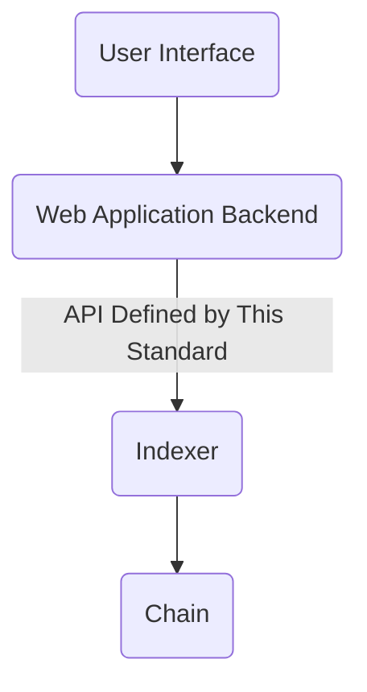
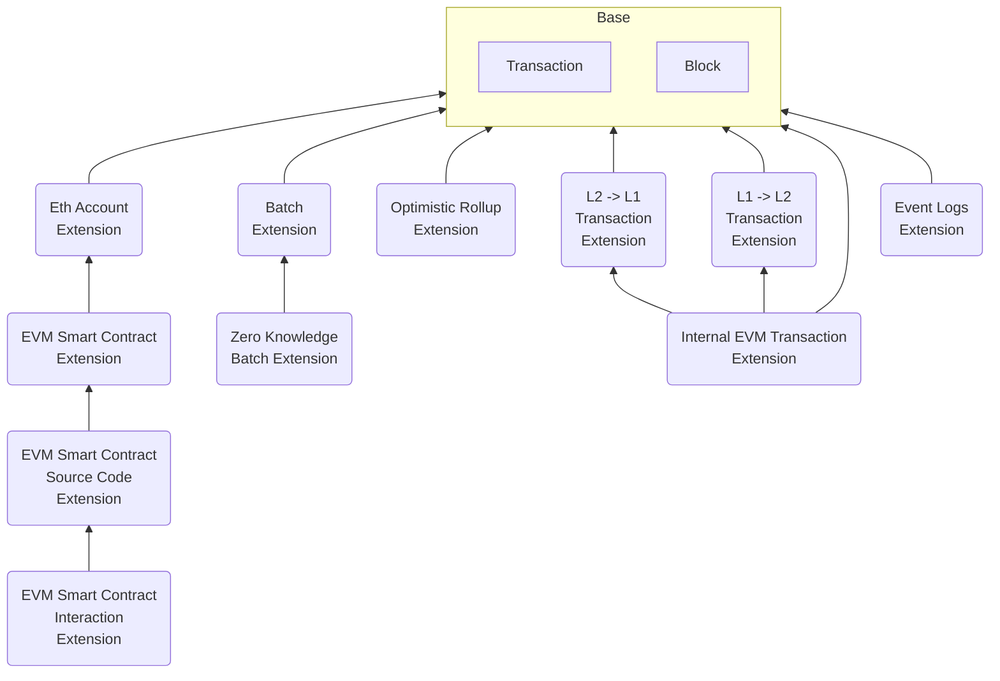
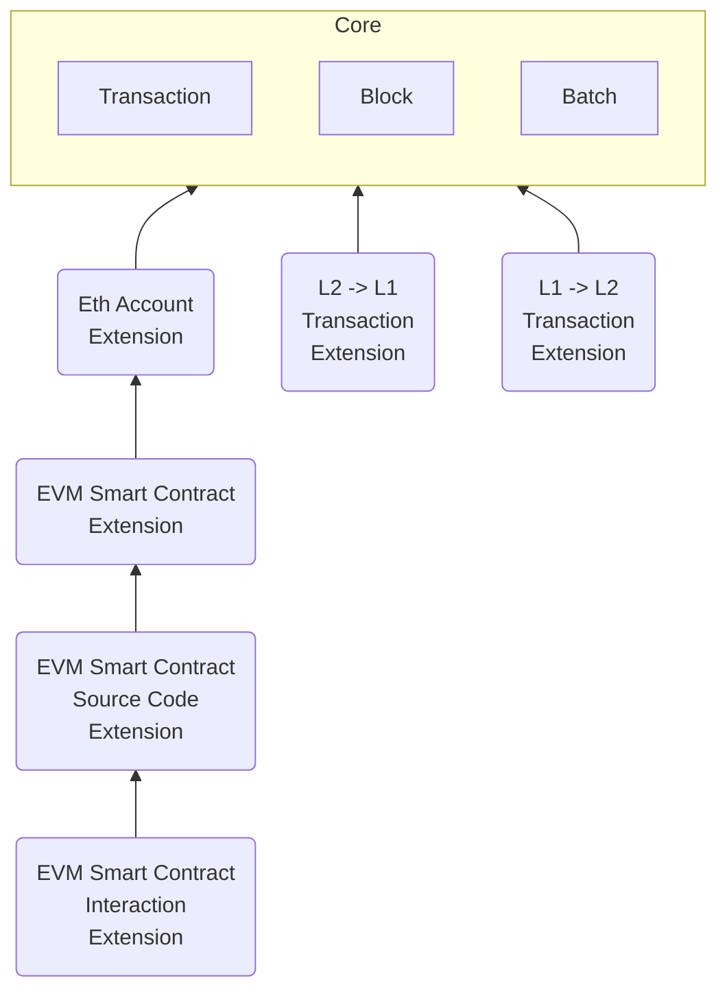

# L2 Block Explorer API Standards

*This research was carried out by the researchers at Quantstamp funded by Quantstamp and the Ethereum Foundation Grant ID FY23-0882 (Back-End API Standard for L2 Block Explorers)*

#### Version
0.1.0. July 21, 2023.

#### Authors
- Alejandro Padilla, Audit Engineer @ Quantstamp, [alejandro@quantstamp.com](mailto:alejandro@quantstamp.com?subject=L2%20Block%20Explorer%20Standard)
- Cameron Biniamow, Audit Engineer @ Quantstamp, [cameron@quantstamp.com](mailto:cameron@quantstamp.com?subject=L2%20Block%20Explorer%20Standard)
- Ali Farooq, Software Engineer @ Quantstamp, [ali@quantstamp.com](mailto:ali@quantstamp.com?subject=L2%20Block%20Explorer%20Standard)
- Jim Wood, Software Engineer @ Quantstamp, [jim@quantstamp.com](mailto:jim@quantstamp.com?subject=L2%20Block%20Explorer%20Standard)
- Marius Guggenmos, Audit Engineer @ Quantstamp, [marius@quantstamp.com](mailto:marius@quantstamp.com?subject=L2%20Block%20Explorer%20Standard)
- Jeff Chen, Junior Research Engineer @ Quantstamp, [jeff.chen@quantstamp.com](mailto:jeff.chen@quantstamp.com?subject=L2%20Block%20Explorer%20Standard)
- Tasheme Thomas, Technical Writer @ Quantstamp, [tasheme@quantstamp.com](mailto:tasheme@quantstamp.com?subject=L2%20Block%20Explorer%20Standard)
- Jan Gorzny, Ph.D., Head of L2 Scaling @ Quantstamp, [jan@quantstamp.com](mailto:jan@quantstamp.com?subject=L2%20Block%20Explorer%20Standard)
- Martin Derka, Ph.D., Head of New Initiatives @ Quantstamp, [martin@quantstamp.com](mailto:martin@quantstamp.com?subject=L2%20Block%20Explorer%20Standard)

#### Summary
This document presents research on APIs powering L2 block explorer. The standard is intended to be modular, to evolve, and to foster community participation in extension and long-term maintenance. This document serves as the gateway into the research contained within this repository. It is organized into three main sections. [Section 1](#sec-the-standard) presents the standard itself. It contains all the individual artifacts which resulted in the existence of the standard, and can be further extended by the community. [Section 2](#sec-the-research) shows the thoughts behind the standard, which resulted in the form that the standard currently has. [Section 3](#sec-contributing) outlines guidelines for contribution. 

#### Table of Contents
- [L2 Block Explorer API Standards](#l2-block-explorer-api-standards)
  - [Version](#version)
  - [Authors](#authors)
  - [Summary](#summary)
  - [Table of Contents](#table-of-contents)
- [1 The Standard](#1-the-standard)
  - [1.1 Expected Architecture](#11-expected-architecture)
  - [1.2 Extension Dependency Graph](#12-extension-dependency-graph)
  - [1.3 API Specification](#13-api-specification)
  - [1.4 Reference Block Explorer Requirements](#14-reference-block-explorer-requirements)
     - [1.4.1 Base Requirements](#141-base-requirements)
     - [1.4.2 Extension Requirements](#142-extension-requirements)
- [2 Investigation](#2-investigation)
  - [2.1 Methodology](#21-methodology)
  - [2.2 L2 Landscape Overview](#22-l2-landscape-overview)
    - [2.2.1 L2 Overview and Representative Selection](#221-l2-overview-and-representative-selection)
    - [2.2.2 L2 Documentation and Models](#222-l2-documentation-and-models)
  - [2.3 Block Explorer Requirements](#23-block-explorer-requirements)
  - [2.4 Existing Block Explorers](#24-existing-block-explorers)
    - [2.4.1 Block Explorers In Use](#241-block-explorers-in-use)
    - [2.4.2 Open Source Block Explorers](#242-open-source-block-explorers)
  - [2.5 Refined Requirements](#25-refined-requirements)
  - [2.6 API Specification](#26-api-specification)
- [3 Contribution Guidelines](#3-contribution-guidelines)

# 1 The Standard

The presented standard defines the API that a layer 2 blockchain needs to expose to a block explorer web application. We do not anticipate that the blockchain would expose the API directly through its nodes, but rather through an indexing service (see the diagram in [Section 1.1](#std-architecture)). The API itself is presented in the OpenAPI format linked from [Section 1.3](#sec-reference-specification). 

The API standard would be self-serving and not useful without a reference block explorer application in mind, we tightly couple it with requirements for a block explorer application. Those are presented in [Section 1.4](#std-refined-requirements). The requirements have the form of a hierarchy of extensions that can be applied to a basic data model of a blockchain that is formed only by blocks and transactions. The hierarchy is described in [Section 1.2](#sec-extension-graph). While the basic model of blocks and transactions would be sufficient to present a rudimentary block explorer for any generic blockchain (not even necessarily L2), the extensions are required to capture the nuances of the L2 families and individual chains.

If implementing a block explorer application that uses this standard, you should select the subset of the specification extensions that your application intends to implement, and require that the API that your application consumes exposes the endpoints that this standard defines for those individual extensions. If you are implementing a blockchain, or an indexer for the blockchain, you should choose the subset of the extensions that apply to your chain, and exposed the specified APIs.

Each requirement in an individual extension is further tagged as *core* or *optional*. The block explorers **MUST** implement all the core requiremetns to implement the extension, but they **CAN** but **DO NOT HAVE TO** implement the optional requirements. Similarly, the API conforming to this standard **MUST** include all the data to support implementation of the core requriements, but **DOES NOT HAVE TO** include the optional data.

The standard is catered towards L2s that use Ethereum as their L1. 

The standard is not intended to be frozen in time. It is inteded to evolve as new L2 networks are developed, and it is structured to foster community contributions (more in [Section 3](#sec-contributing)).

## 1.1 Expected Architecture

The API Specification assumes a block chain explorer architecture of four levels as depicted:

The reference API is therefore only intended for fetching data that exists on-chain by the block explorer web application - either via an intermediate indexer, or directly through a node on the chain. This document therefore explicitly excludes information not stored on-chain such as smart contract source code.

## 1.2 Extension Dependency Graph

The API standard has a hierarchical structure formed by the *Base* requirements and APIs, and *Extensions* to those. See the introduction in [Section 1](#sec-the-standard) for more details. Here we present the hierarchy in the form of a graph (DAG).

## 1.3 API Specification

We provide the specification in the OpenAPI format. The reference OpenAPI specification files can be found in the [open-api](./open-api/) directory:

- [Base Data Endpoints](./open-api/1_4_1_core.yml) (accommodates requirements listed in [Sections 1.4.1.1](#1411-transactions) and [1.4.1.2](#1412-blocks))
- [Block Batch Extension](./open-api/1_4_2_1_block_batch.yml) (accommodates requirements listed in [Section 1.4.2.1](#1421-block-batch-extension))
- [Ethereum Account Extension](./open-api/1_4_2_2_eth_account.yml) (accommodates requirements listed in [Section 1.4.2.2](#1422-ethereum-account-extension))
- [EVM Smart Contract Extension](./open-api/1_4_2_3_evm_smart_contract.yml) (accommodates requirements listed in [Section 1.4.2.3](#1423-evm-smart-contract-extension))
- Requirements listed in [Section 1.4.2.4](#1424-evm-smart-contract-source-code-extension) related to verification of smart contract source code are not matched with a reference API as the source code of smart contract is not persisted on-chain and should be managed on the block explorer application level rather than by the chain indexer
- Requirements listed in [Section 1.4.2.5](#1425-evm-smart-contract-interaction-extension) related to interaction of the block explorer with smart contracts, typically using the web3 library, and thus are not matched with a reference API
- [L1->L2 Transactions Extension](./open-api/1_4_2_6_l1_l2_tx.yml) (accommodates requirements listed in [Section 1.4.2.6](#1426-l1-l2-transactions-extension))
- [L2->L1 Transactions Extension](./open-api/1_4_2_7_l2_l1_tx.yml) (accommodates requirements listed in [Section 1.4.2.7](#1427-l2-l1-transactions-extension))
- [Optimistic Rollup Extension](./open-api/1_4_2_8_or.yml) (accommodates requirements listed in [Section 1.4.2.8](#1428-optimistic-rollup-extension))
- [Zero Knowledge Batch Extension](./open-api/1_4_2_9_zk_batch.yml) (accommodates requirements listed in [Section 1.4.2.9](#1429-zero-knowledge-batch-extension))
- [Internal EVM Transaction Extension](./open-api/1_4_2_10_internal_evm_tx.yml) (accommodates requirements listed in [Section 1.4.2.10](#14210-internal-evm-transaction-extension))
- [Event Logs Extension](./open-api/1_4_2_11_event_logs.yml) (accommodates requirements listed in [Section 1.4.2.11](#14211-event-logs-extension))

## 1.4 Reference Block Explorer Requirements

In this section, we list requirements for a block explorer web application that can be supported by the standardized API presented in [Section 1.3](#sec-reference-specification).

### 1.4.1 Base Requirements

The base requirements focus on the basis of a generic L2 blockchain. They capture only the basic aspect - the chain contains some blocks, and those blocks contain transactions. The extensions to this basic concept are covered in [Section 1.4.2](#std-refined-requirements-extensions). See [Section 1.2](#sec-extension-graph) for the extension dependency graph.

#### 1.4.1.1 Transactions

| ID | Description | Core or Optional |
| :--- | --- | ---: |
| TX1 | A block explorer **MUST** display a list of L2 transactions. | Core |
| TX2 | The list of L2 transactions **MUST** be sequential and sortable with a default sorting that displays the more recent L2 transactions first. | Core |
| TX3 | The list of L2 transactions **MUST** contain at least the L2 transactions that are a part of the current chain as per the definition of the “current state” of the rollup. | Core |
| TX4 | The list of L2 transactions **MUST** contain at least the identifier of the L2 transactions (such as the hash). | Core |
| TX5 | The list of L2 transactions **SHOULD** include L2 transactions that are not yet part of the state, but it is expected that they will become part of the state in the future (e.g. they are in the pending L2 blocks). | Optional |
| TX6 | A block explorer **MUST** display the core details of each individual L2 transaction. | Core
| TX7 | The page displaying the details of an L2 transaction **MUST** be directly accessible via the transaction hash. | Core |
| TX8 | A block explorer **SHOULD** display the optional details of each individual L2 transaction. The details to display depend on the specific chain. | Optional |
| TX9 | A block explorer **SHOULD** display the details of each individual L2 transaction that is known to the chain (the transaction was at some point submitted to the nodes, but was dropped or has not been processed yet), but is not part of the current chain’s state as per the definition of the “current state” of the rollup. | Optional |
| TX10 | When displaying details of a single L2 transaction, the block explorer **MUST** display at least the following information:  <ol><li>Transaction hash</li><li>Execution status (Success or Error)</li><li>Block identifier (Nullable)</li><li>Nonce</li><li>Rollup transaction information (Nullable)</li><li>Sender</li><li>Receiver</li><li>Amount of native token (such as Ether) attached (value)</li><li>Transaction fee</li><li>Gas price</li><li>Gas limit and usage by the transaction</li><li>Input data (e.g. calldata)</li></ol> | Core |

#### 1.4.1.2 Blocks

| ID | Description | Core or Optional |
| :--- | --- | ---: |
| BL1 | A block explorer **MUST** display a list of L2 blocks. | Core |
| BL2 | The list of L2 blocks **MUST** be sequential and sortable with a default sorting that displays the more recent L2 blocks first. | Core |
| BL3 | The list of L2 blocks **MUST** contain at least the L2 blocks that are a part of the current chain as per the definition of the “current state” of the rollup. | Core
| BL4 | The list of L2 blocks **MUST** contain at least the identifier of the L2 block (e.g. block hash). | Core
| BL5 | The list of L2 blocks **SHOULD** include L2 blocks that are not yet part of the state (e.g. pending L2 blocks), but it is expected that they will become part of the state in the future. | Optional |
| BL6 | A block explorer **MUST** display the core details of each individual L2 block. | Core |
| BL7 | The page displaying the details of an L2 block **MUST** be directly accessible via the unique block identifier (e.g. hash, but not block number). | Core |
| BL8 | A block explorer **SHOULD** display the optional details of each individual L2 block. The details to display depend on the specific chain. | Optional |
| BL9 | A block explorer **SHOULD** display the details of each individual L2 block that is known to the chain (either, the block is not yet fully included in the state, or it is not a part of the state any more), but is not part of the current chain’s state as per the definition of the “current state” of the rollup.| Optional |
| BL10 | When displaying details of a single L2 block, the block explorer MUST display at least the following information: <ol><li>Block height</li><li>Timestamp</li><li>List of transactions in this block</li><li>Block batch identifier (Nullable)</li><li>Status of the block with respect to the state of the chain</li><li>Block identifier (such as the hash)</li><li>Parent block identifier (such as the hash)</li></ol> | Core |

### 1.4.2 Extension Requirements

This section covers the extensions to base requirements presented in [Section 1.4.1](#std-refined-requirements-base). See [Section 1.2](#sec-extension-graph) for the extension dependency chart.

#### 1.4.2.1 Block Batch Extension

| ID | Description | Core or Optional |
| :--- | --- | ---: |
| X_BB_1 | A block explorer **MUST** display a list of L2 block batches. | Core |
| X_BB_2 | The list of L2 block batches **MUST** be sequential and sortable with a default sorting that displays the more recent L2 batches first. | Core |
| X_BB_3 | The list of L2 block batches **MUST** contain at least the L2 block batches that are a part of the current chain as per the definition of the “current state” of the rollup. | Core |
| X_BB_4 | The list of L2 block batches **MUST** contain at least the identifier of the L2 block batch. | Core |
| X_BB_5 | The list of L2 block batches **SHOULD** include L2 block batches that are not yet part of the state (e.g. pending L2 block batches), but it is expected that they will become part of the state in the future. | Optional |
| X_BB_6 | A block explorer **MUST** display the core details of each individual L2 block batch. | Core |
| X_BB_7 | The page displaying the details of an L2 block batch **MUST** be directly accessible via the unique block batch identifier (e.g. hash). | Core |
| X_BB_8 | A block explorer **SHOULD** display the optional details of each individual L2 block batch. The details to display depend on the specific chain. | Optional |
| X_BB_9 | A block explorer **SHOULD** display the details of each individual L2 block batch that is known to the chain (either, the block batch is not yet fully included in the state, or it is not a part of the state any more), but is not part of the current chain’s state as per the definition of the “current state” of the rollup. | Optional |
| X_BB_10 | When displaying details of a single L2 block batch, the block explorer **MUST** display at least the following information: <ol><li>Batch identifier</li><li>Timestamp</li><li>List of L2 blocks in this batch</li><li>Status of the batch with respect to the state of the chain</li></ol> | Core |
| X_BB_11 | When displaying details of a single L2 block, the block explorer **MUST** display at least the following information in addition to the information stipulated by other requirements: <ol><li>Block batch identifier (Nullable)</li></ol> | Core |

#### 1.4.2.2 Ethereum Account Extension

| ID | Description | Core or Optional |
| :--- | --- | ---: |
| X_EA_1 | A block explorer **MUST** display the core details of each individual account. | Core |
| X_EA_2 | The page displaying the details of an account **MUST** be directly accessible via the address. | Core |
| X_EA_3 | When displaying details of a single account, the block explorer **MUST** display at least the following information: <ol><li>Account address</li><li>Balance in the native token</li><li>List of L2 transactions sent from this account</li><li>List of L2 transactions sent to this account</li></ol> | Core

#### 1.4.2.3 EVM Smart Contract Extension

| ID | Description | Core or Optional |
| :--- | --- | ---: |
| X_SC_1 | A block explorer **MUST** indicate that an account is a smart contract if it has non-null bytecode. | Core |
| X_SC_2 | When displaying details of a smart contract account, the block explorer **MUST** display the following information in addition to the other account details defined previously:<ol><li>The bytecode</li><li>The deployment transaction hash</li><li>The Contract creator address</li></ol> | Core |

#### 1.4.2.4 EVM Smart Contract Source Code Extension

| ID | Description | Core or Optional |
| :--- | --- | ---: |
| X_SCSC_1 | A block explorer **MUST** provide the option of verifying smart contracts. | Core |
| X_SCSC_2 | A block explorer **MUST** accept the source code if it compiles into the deployed bytecode given the constructor parameters and the configuration of the compiler. | Core |
| X_SCSC_3 | A block explorer **MUST** reject the source code if it does not compile into the deployed bytecode given the constructor parameters and the configuration of the compiler. | Core |
| X_SCSC_4 | When displaying details of a smart contract account, the block explorer **MUST** display the following information in addition to the other smart contract account details defined previously: <ol><li>The smart contract source code (Nullable)</li><li>The smart contact ABI (Nullable)</li><li>Construction parameters (Nullable)</li><li>Compiler configuration (Nullable)</li></ol> NOTE: All of these are null or not null depending if the source code was accepted or not. | Core |
| X_SCSC_5 | A block explorer **MUST** provide the option to challenge the existing verified contract source code. If the smart contract source code does not compile into the deployed bytecode given the constructor parameters and the configuration of the compiler, then the block explorer **MUST** nullify the above smart contract details. | Core |

#### 1.4.2.5 EVM Smart Contract Interaction Extension

| ID | Description | Core or Optional |
| :--- | --- | ---: |
| X_SCI_1 | A block explorer **MUST** be able to create L2 transactions that interact with the write methods of smart contracts that have verified code. | Core |
| X_SCI_2 | A block explorer **MUST** be able to invoke read methods and display the return value of smart contracts that have verified code. | Core |

#### 1.4.2.6 L1->L2 Transactions Extension

| ID | Description | Core or Optional |
| :--- | --- | ---: |
| X_L1L2_1 | A block explorer **MUST** indicate that a transaction in the list of L2 transactions is L1->L2 if it is. | Core |
| X_L1L2_2 | When displaying details of a single L1->L2 transaction, the block explorer **MUST** display the following information in addition to the other L2 transaction details defined previously: <ol><li>The originating L1 transaction hash</li></ol> | Core |

#### 1.4.2.7 L2->L1 Transactions Extension

| ID | Description | Core or Optional |
| :--- | --- | ---: |
| X_L2L1_1 | A block explorer **MUST** indicate that a transaction in the list of L2 transactions is L2->L1 if it is. | Core |
| X_L2L1_2 | When displaying details of a single L2->L1 transaction, the block explorer **MUST** display the following information in addition to the other L2 transaction details defined previously: <ol><li>The executing L1 transaction hash (Nullable)</li></ol> | Core |

#### 1.4.2.8 Optimistic Rollup Extension

| ID | Description | Core or Optional |
| :--- | --- | ---: |
| X_OR1 | A block explorer **MUST** indicate that a block in the list of L2 blocks has been challenged if it was. | Core |
| X_OR2 | When displaying details of a challenged L2 block, the block explorer **MUST** display the following information in addition to the other L2 block details defined previously: <ol><li>The L1 challenge transaction</li><li>The status of the challenge (whether it was valid, or not)</li></ol> | Core

#### 1.4.2.9 Zero Knowledge Batch Extension

| ID | Description | Core or Optional |
| :--- | --- | ---: |
| X_ZK1 | When displaying details of a batch, the block explorer **MUST** display the following information in addition to the other batch details defined previously:<ol><li>The L1 state update transaction (Nullable)</li><li>The validity proof payload (Nullable)</li></ol> | Core |

#### 1.4.2.10 Internal EVM Transaction Extension
| ID | Description | Core or Optional |
| :--- | --- | ---: |
| X_IT1 | A block explorer **MUST** display the internal transactions[[1]](#internal-tx-def) (message calls) that were triggered while executing the L2 transaction. | Core |
| X_IT2 | When displaying details of an internal transaction, the block explorer **MUST** display at least the following information: <ol><li>The address of the smart contract that originated the internal transaction.</li><li>The destination address.</li>	 | Core |
| X_IT3 | When displaying details of an internal transaction, the block explorer **SHOULD** display the following information: <ol><li>A type trace address[[3]](#type-trace-addr-def) or an identifier of the internal transaction.</li><li>The type of internal transaction[[2]](#internal-tx-type-def).</li><li>The value being transferred in the internal transaction.</li></ol> | Optional |

**Internal Transaction.** This refers to transactions that take place between smart contracts, including transactions from a smart contract to an external address when sending ETH to a user. When an external address calls a smart contract to execute an operation, the contract's built-in logic calls other contracts needed for completion. In a single transaction, a smart contract may need to perform several internal transactions with one or many contracts.

**Type of internal transaction.** In most block explorers, the type of internal transaction is determined by the OPCODE that was used to trigger the internal transaction. For example, `CREATE`, `CALL`, `STATICCALL`, `DELEGATECALL`, `SUICIDE`, etc. 

**Type Trace Address.** An identifier used by some block explorers to identify internal transactions within a transaction. For example, `call_0_1`. This identifier consists of two parts:<ol>
<li>The type of internal transaction (e.g., <code>call</code>, <code>staticcall</code>, <code>create</code>, <code>suicide</code>, etc).</li>
<li>The trace address, which is the index of a given internal transaction in an EVM trace tree (EVM traces provide a step-by-step record of what happened during the execution of a transaction and are represented in a tree format).</li></ol>

#### 1.4.2.11 Event Logs Extension
| ID | Description | Core or Optional |
| :--- | --- | ---: |
| X_LE1 | A block explorer **MUST** display the events emitted while executing the L2 transaction. | Core |
| X_LE2 | When displaying details of an emitted event, the block explorer **MUST** display at least the following information:<ol><li>An index or identifier that uniquely identifies the event in the transaction.</li><li>The address of the smart contract that emitted the event.</li><li>The signature of the event[[1]](#event-logs-signature) (if the source code of the contract is available to the block explorer).</li><li>The topics[[2]](#event-logs-topic) of the event.</li><li>The value of each of the parameters sent in the event.</li></ol> | Core |
| X_LE3 | A block explorer **SHOULD** indicate if each parameter in an event is indexed or not. | Optional |
| X_LE4 | A block explorer **SHOULD** allow the representation of event parameters in different formats (e.g. decimal, hexadecimal). | Optional |

**Event Signature.** The combination of the event name and the types of parameters it contains. For example, `Transfer(address,address,uint256)`. 

**Log Topic.** A log topic is a 32-byte word used to describe the inner workings of an event. A log object describing an event can have up to four topics. The first topic corresponds to the keccak256 hash of the event signature (except for anonymous events). The remaining topics are used for the values of indexed parameters in the event. Topics are typically used to narrow down search queries based on data.

# 2 Investigation

This section outlines the systematic investigation of the L2 block explorer API that resulted in the presented standard. 

## 2.1 Methodology

In this section, we describe the methodology applied to the investigation in the block explorers.

1. __Mapping the L2 landscape.__  We begin the investigation by listing L2s and other blockchains relevant for this work. We note down some basic characteristics about these networks: are they zero-knowledge or optimistic rollups, are they EVM compatible, what blockchain explorer do they use, etc. Based on these attributes, we make a shortlist of networks that we will use for deriving data.
2. __Documenting transaction models.__ For the selected blockchains from the L2 landscape, we document the model for executing transactions and their respective rollups. We use sequence and entity-relationship diagrams to capture the information more formally.
3. __Defining a block explorer.__ Before proposing an API standard, we need to define what we actually mean by a block explorer.  We base this definition on the individual transaction models, derive commonalities and elicit requirements for a sensible block explorer. We define the minimum functionality based on the common patterns (such as a block list visualization), and call such requirements *base*. We further define a system of optional extensions to the *base requirements*. This makes our standard modular.
4. __Cross-referencing the block explorer features.__ Having defined requirements for a block explorer, we evaluate the existing block explorer implementations. We evaluate both the closed source explorers that are currently used by selected networks, and the open source block explorer implementations.
5. __Refining the requirements.__ Based on our survey of the existing implementations as well as the network features, we refine the original requirements. We focus on universality and the proper isolation of features into individual modules.
6. __Proposing the API.__ With the systematic preparation done, we can propose an API that allows for implementation of the required features.
7. __Describing a sample indexing service implementation.__ To demonstrate the feasibility, we include a high-level description of how an indexing service that serves the required API could be implemented. 

## 2.2 L2 Landscape Overview

In this section, we present a comparison of L2 networks, and select networks that we will use as a representative sample during our investigation.

### 2.2.1 L2 Overview and Representative Selection 

| Name                                | Status                                              | L2 Type               | Application Type                                             | EVM Compatible       | Explorer(s)                                                  | Links                                                        | TVL [5/11/23] |
| :---------------------------------- | --------------------------------------------------- | --------------------- | ------------------------------------------------------------ | -------------------- | ------------------------------------------------------------ | ------------------------------------------------------------ | ------------- |
| [Arbitrum Nova](#Arbitrum-Nova)     | Active                                              | OP Rollup             | Universal                                                    | Yes (EVM Compatible) | [Arbiscan Nova](https://nova.arbiscan.io/), [Arbitrum Nova BlockScout](https://nova-explorer.arbitrum.io/) | [Arbitrum Nova Website](https://nova.arbitrum.io/) \| [Arbitrum AnyTrust Docs](https://developer.arbitrum.io/inside-arbitrum-nitro/#inside-anytrust) \| [Arbiscan Nova API Docs](https://docs.arbiscan.io/v/nova-arbiscan) \| [BlockScout Docs](https://docs.blockscout.com/) | $17.27M       |
| [Arbitrum One](#Arbitrum-One)       | Active                                              | OP Rollup             | Universal                                                    | Yes (EVM Compatible) | [Arbiscan](https://arbiscan.io/)                             | [Arbitrum One Website](https://arbitrum.io/) \| [Arbitrum Docs](https://developer.arbitrum.io/) \| [Arbiscan API Docs](https://docs.arbiscan.io/) | $5.77B        |
| [Aztec](#Aztec)                     | Deprecated                                          | ZK Rollup             | [Application Specific (Private Payments)](https://old.zk.money/) | No                   | [Aztec Explorer](https://explorer.aztec.network/)            | [Aztec Website](https://aztec.network/) \| [Aztec Docs](https://developers.aztec.network/) \| [Aztec Connect Explorer Github](https://github.com/AztecProtocol/aztec-connect-explorer) | $2.67M        |
| [Aztec Connect](#Aztec-Connect)     | Deprecated                                          | ZK Rollup             | [Application Specific (Private DeFi)](https://zk.money/)     | No                   | [Aztec Connect Explorer](https://aztec-connect-prod-explorer.aztec.network/) | [Aztec Connect Website](https://aztec.network/) \| [Aztec Docs](https://developers.aztec.network/) \| [Aztec Connect Explorer Github](https://github.com/AztecProtocol/aztec-connect-explorer) | $7.99M        |
| [Aztec zkRollup](#Aztec-zkRollup)   | Upcoming                                            | ZK Rollup             | Universal                                                    | No                   | -                                                            | [Aztec Website](https://aztec.network/aztec) \| [Aztec Docs](https://docs.aztec.network/) | -             |
| [Base](#Base)                       | Active (Testnet only)                               | OP Rollup             | Universal                                                    | Yes                  | [Base BlockScout](https://base-goerli.blockscout.com/), [BaseScan](https://goerli.basescan.org/) | [Base Website](https://base.org/) \| [Base Docs](https://docs.base.org/) \| [Base BlockScout API Docs](https://base-goerli.blockscout.com/api-docs) \| [BaseScan API Docs](https://goerli.basescan.org/apis) | -             |
| [Boba Network](#Boba-Network)       | Active                                              | OP Rollup             | Universal                                                    | Yes                  | [Bobascan](https://bobascan.com/), [Boba Avalanche BlockScout](https://blockexplorer.bobaopera.boba.network/) | [Boba Network Website](https://boba.network/) \| [Boba Network Docs](https://docs.boba.network/) \| [Bobascan API Docs](https://bobascan.com/apis) \| [Boba Avalanche BlockScout API Docs](https://blockexplorer.avax.boba.network/api-docs) | $11.04M       |
| [Canvas Connect](#Canvas-Connect)   | Active (Only for whitelisted institutional clients) | Validium              | Application Specific (Privacy, Finance)                      | No                   | -                                                            | [Canvas Connect Website](https://canvas.co/) \| [Canvas Connect Docs](https://canvas.co/canvas-connect#WHAT-IS-CONNECT) | $8.5K         |
| [dYdX](#dYdX)                       | Active                                              | ZK Rollup             | [Application Specific (Exchange)](https://dydx.exchange/)    | No                   | [L2 Beat dYdX Explorer](https://dydx.l2beat.com/)            | [dYdX Docs](https://docs.dydx.exchange/) \| [dYdX Explorer Github](https://github.com/l2beat/starkex-explorer) | $344M         |
| [Fuel v1](#Fuel-v1)                 | Active (Testnet only)                               | OP Rollup             | [Application Specific (Exchange)](https://fuellabs.github.io/swayswap/welcome/connect) | Yes                  | [Fuel Explorer](https://mainnet.fuel.sh/network/), [Fuel Testnet Explorer](https://fuellabs.github.io/block-explorer-v2/beta-3/?ref=fuel-labs.ghost.io#/) | [Fuel v1 Website](https://fuel.sh/) \| [Fuel v1 Docs](https://docs.fuel.sh/) \| [Fuel Explorer GitHub](https://github.com/FuelLabs/fuel-explorer) | $463          |
| [ImmutableX](#ImmutableX)           | Active                                              | Validium              | [Application Specific (NFT, Exchange)](https://www.immutable.com/products) | No                   | [Immutascan](https://immutascan.io/)                         | [ImmutableX Website](https://www.immutable.com/) \| [ImmutableX Docs](https://docs.x.immutable.com/docs/start-here) \| [ImmutableX API Docs](https://docs.x.immutable.com/reference#/) \| [StarkEx Docs](https://docs.starkware.co/starkex/) | $97.85M       |
| [Immutable zkEVM](#Immutable-zkEVM) | Upcoming                                            | ZK Rollup             | Universal                                                    | Yes                  | -                                                            | [Immutable zkEVM Docs](https://docs.immutable.com/docs/overview/zkevm-overview) | -             |
| [Layer2.Finance](#Layer2.Finance)   | Active                                              | OP Rollup & ZK Rollup | Application Specific (DeFi Aggregation)  [OP Version](https://layer2.finance/), [ZK Version](https://zk.layer2.finance/#/invest) | No                   | -                                                            | [Layer2 Website](https://layer2.finance/) \| [Layer2 Docs](https://docs.l2.finance/) | $168K         |
| [Loopring](#Loopring)               | Active                                              | ZK Rollup             | [Application Specific (Tokens, NFTs, AMM)](https://exchange.loopring.io/swap) | No                   | [Loopring zkRollup Explorer](https://explorer.loopring.io/)  | [Loopring Website](https://loopring.org/) \| [Loopring Docs](https://github.com/Loopring/protocols/blob/master/packages/loopring_v3/DESIGN.md) \| [Loopring Explorer GitHub](https://github.com/Loopring/loopring-explorer) | $108M         |
| [Mantle](#Mantle)                   | Active (Testnet only)                               | OP Rollup             | Universal                                                    | Yes                  | [Mantle Explorer](https://explorer.testnet.mantle.xyz/)      | [Mantle Website](https://www.mantle.xyz/) \| [Mantle Docs](https://docs.mantle.xyz/) \| [Mantle Explorer API Docs](https://explorer.testnet.mantle.xyz/api-docs) \| [Mantle Explorer GitHub](https://github.com/mantlenetworkio/blockscout) | -             |
| [Metis Andromeda](#Metis-Andromeda) | Active                                              | OP Chain             | Universal                                                    | Yes                  | [Metis BlockScout](https://andromeda-explorer.metis.io/)     | [Metis Website](https://www.metis.io/) \| [Metis Docs](https://docs.metis.io/) \| [Metis BlockScout API Docs](https://andromeda-explorer.metis.io/api-docs) | $109M         |
| [Optimism](#Optimism)               | Active                                              | OP Rollup             | Universal                                                    | Yes                  | [Optimisim Etherscan](https://optimistic.etherscan.io/), [Optimism BlockScout](https://blockscout.com/optimism/mainnet) | [Optimism Website](https://optimism.io/) \| [Optimism Docs](https://community.optimism.io/) \| [Optimism Etherscan API Docs](https://docs.optimism.etherscan.io/) \| [Optimism BlockScout API Docs](https://blockscout.com/optimism/mainnet/api-docs) | $1.86B        |
| [Polygon zkEVM](#Polygon-zkEVM)     | Active                                              | ZK Rollup             | Universal                                                    | Yes (EVM Equivalent) | [Polygonscan](https://zkevm.polygonscan.com/)                | [Polygon zkEVM Website](https://polygon.technology/polygon-zkevm) \| [Polygon zkEVM Docs](https://zkevm.polygon.technology/) \| [Polygonscan API Docs](https://zkevm.polygonscan.com/apis) | $7.47M        |
| [Scroll](#Scroll)                   | Active (Testnet only)                               | ZK Rollup             | Universal                                                    | Yes                  | [Scroll BlockScout](https://blockscout.scroll.io/), [Scroll Unifra](https://scrollexplorer.unifra.io/), [Scroll Rollup Explorer](https://scroll.io/alpha/rollupscan?page=1&per_page=10) | [Scroll Website](https://scroll.io/) \| [Scroll Docs](https://guide.scroll.io/) \| [Scroll Architecture](https://scroll.io/blog/architecture) \| [Scroll BlockScout API Docs](https://blockscout.scroll.io/api-docs) | -             |
| [StarkNet](#StarkNet)               | Active                                              | ZK Rollup             | Universal                                                    | No                   | [Voyager](https://voyager.online/), [Starkscan](https://starkscan.co/) | [StarkNet Website](https://starknet.io/) \| [StarkNet Docs](https://starknet.io/what-is-starknet/) \| [Voyager Docs](https://nethermind.io/voyager/) \| [Starkscan API Docs](https://starkscan.readme.io/reference/starkscan-api-introduction) | $46.74M       |
| [ZKSpace](#ZKSpace)                 | Active                                              | ZK Rollup             | [Application Specific (Tokens, NFTs, AMM)](https://zks.app/wallet/token) | No                   | [ZKSpace Explorer](https://zkspace.info/)                    | [ZKSpace Website](https://zks.org/) \| [ZKSpace Docs](https://en.wiki.zks.org/) \| [ZKSpace Explorer Docs](https://era.zksync.io/docs/api/tools/block-explorer/) | $48.15M       |
| [zkSync Era](#zkSync-Era)           | Active                                              | ZK Rollup             | Universal                                                    | Yes                  | [zkSync Era Explorer](https://explorer.zksync.io/)           | [zkSync Website](https://zksync.io/) \| [zkSync Docs](https://era.zksync.io/docs/) \| [zkSync Era Explorer Docs](https://era.zksync.io/docs/api/tools/block-explorer/) | $240M         |
| [zkSync Lite](#zkSync-Lite)         | Active                                              | ZK Rollup             | [Application Specific (Payments, Tokens)](https://lite.zksync.io/) | No                   | [zkScan](https://zkscan.io/)                                 | [zkSync Lite Website](https://zksync.io/) \| [zkSync Lite Docs](https://docs.zksync.io/dev/) \| [zkSync Lite API Docs](https://docs.zksync.io/api/) | $76M          |

#### Arbitrum Nova

- The first [Arbitrum AnyTrust Chain](https://developer.arbitrum.io/intro/glossary#arbitrum-anytrust-chain) running on Ethereum mainnet. 
- Gaming and social use cases. 
- Implements the [Arbitrum AnyTrust Protocol](https://developer.arbitrum.io/intro/glossary#arbitrum-anytrust-protocol), not the [Arbitrum Rollup Protocol](https://developer.arbitrum.io/intro/glossary#arbitrum-rollup-protocol) protocol.
- Etherscan and BlockScout explorers.
- Focuses on ultra-low transaction fees - it's meant to be used by cost-sensitive apps. 
- Nova differs from Arbitrum One by not posting transaction data on-chain but to Data Availability Committee. 
- **Proof construction relies fully on data that is NOT published on-chain.** There is a data availability committee (DAC) that is tasked with protecting and supplying the data. 
- Just like Arbitrum One, it supports Nitro technology to be EVM compatible. 

#### Arbitrum One

- Arbiscan was built by the Etherscan team.
- As of May 2023, it has a total value locked (TVL) of approximately 5.8 billion USD.
- Full EVM compatibility. Previously, would use the AVM (Arbitrum Virtual Machine) to achieve this, now it is done via Nitro (it uses WASM - WebAssembly). 
- All data is available on-chain. 
- The first [Arbitrum Rollup Chain](https://developer.arbitrum.io/intro/glossary#arbitrum-rollup-chain) running on Ethereum mainnet. 
- Fully trustless; inherits Ethereum's base-layer security guarantees without introducing additional trust assumptions.
- Used for decentralized finance and other use-cases that demand L1-level trustlessness.

#### Aztec

- The Aztec protocol has been deprecated. Deposits and shielding are no longer accepted, and blocks will be processed until the 8th of July, 2023 to allow users to withdraw their funds. 
- Aztec was an open-source layer 2 network aiming to bring scalability and privacy to Ethereum. 
- It aimed to enable affordable, private crypto payments via zero-knowledge proofs. 
- Used **ZK-SNARKS**. 
- All the data needed for proof construction is published on-chain. 
- Balances and identities for all tokens on the Aztec rollup are encrypted. Each transaction is encoded as a zkSNARK, protecting user data. 
- This project was replaced by Aztec Connect, which in turn is being deprecated, for a new version of Aztec with support for Aztec Noir. 

#### Aztec Connect

- Aztec Connect [stopped operations](https://medium.com/aztec-protocol/sunsetting-aztec-connect-a786edce5cae) on March 21st, 2023. Moving forward, Aztec Connect will only allow for withdrawals for one year. 
- Privacy-first ZK Rollup. Aims to bring scalability and privacy to Ethereum. 
- Aimed to enable affordable, private crypto payments via zero-knowledge proofs. 
- Uses **ZK-SNARKS**. 
- All data needed for proof construction is published on-chain. 
- The explorer appears to be custom.

#### Aztec zkRollup

- The Aztec team is shifting the resources used for Aztec Connect to two projects: 
  - [Aztec Noir:](https://aztec.network/noir) A programming language for writing and verifying zero-knowledge proofs. Their goal is to make it easy to incorporate zero-knowledge cryptograpy in applications, without deep cryptography knowledge. 
  - [New Aztec encrypted ZK Rollup:](https://medium.com/aztec-protocol/aztec-the-hybrid-zkrollup-a90a197bf22e) They are creating a new rollup, based on Aztec Connect's infrastructure, with support for their Aztec Noir programming language. 
- This rollup will allow private smart contract execution. 

#### Base

- Based on Optimism Bedrock.
- Base has minor differences from Ethereum including opcodes, block time and size, and some [custom JSON-RPC methods](https://community.optimism.io/docs/developers/build/json-rpc/).

#### Boba Network

- The block explorer is also based on Etherscan. 
- It is based on [Optimism](https://messari.io/report/boba-network-an-optimistic-approach-to-ethereum-scaling). However, they have added a swap-based mechanism to allow for faster withdrawal times. Also, they approach cross-chain and bridging differently. 
- As of May 2023, it has a total value locked (TVL) of approximately 11.19M USD.
- Boba is built and maintained by Enya and the OMG Foundation (they deal with OMG Plasma network too). 
- It appears that there is also a [blockscout explorer](https://blockexplorer.bobaopera.boba.network/) for Boba. In fact, the OMG GitHub has a Blockscout project. However, Blockscout is not mentioned in their official documentation. 

#### Canvas Connect 

- Built using StarkEx technology.
- Provides centralized investment and trading services to financial institutions.
- Private chain without a public block explorer.
- Uses **ZK-STARKs**.
- Proof construction relies entirely on data that is NOT published on-chain.

#### dYdX

- This is an exchange. 
- It is based on Starkware (StarkEx)
- The block explorer is NOT officially supported by dYdX (does not appear in their documentation). It was created by L2Beat (with funding from StarkWare). 
- It uses **ZK-Snarks**. 
- All data for **proof construction** is published on-chain. 
- As of May 2023, it has a total value locked (TVL) of approximately 351M USD.

#### Fuel v1 

- Low/no activity on the Fuel mainnet - unclear what there roadmap looks like.
- Fuel testnet is active but uses a different block explorer than the mainnet.
- All of the data needed for proof construction is published on-chain.
- Application specific (exchange).

#### ImmutableX

- Based on StarkEx. 
- Their documentation does not describe it as a validium. However, L2Beat classifies it as such. This is probably because proof of construction relies fully on data that is NOT published on-chain. There exists a data availability committee (DAC) that is tasked with protecting and supplying the data. 
- Focuses a lot on games. It is a Layer 2 for NFTs. 
- It looks like their blockchain explorer was built by the community.
- Uses **ZK-Starks**.
- Provides an escape hatch (MP)

#### Immutable zkEVM 

- Built using [Polygon zkEVM](https://www.immutable.com/blog/immutable-and-polygon-labs-partner-to-create-the-new-home-for-web3-gaming).
- Still in development.
- No block explorer.

#### Layer2.Finance 

- Application-specific layer 2 which aggregates users' DeFi transactions.
- All of the data needed for proof construction is published on-chain.
- No block explorer.

#### Loopring

- Uses **ZK-SNARKS**. 
- All of the data needed for proof construction is published on-chain. 
- Provides an escape hatch (MP)
- It does not appear to be EVM compatible. 

#### Mantle 

- Currently only on a testnet.
- Appears to use a custom BlockScout explorer.
- Has a public repo for the custom explorer.

#### Metis Andromeda

- Based on Optimism.
- According to Metis documentation, this is a Rollup. However, L2Beat calls it an optimistic chain. This is probably because, according to L2 Beat, since April 2022 they use an "optimistic data availability" scheme in which transaction data is kept off-chain in MEMO, while Validators can request tx data from Sequencer via L1 challenge mechanism if it does not make it available for validation off-chain. 
- **Note:** MEMO is an off-chain decentralized storage from MemoLabs. 
- The block explorer is based on Blockscout. 
- The EVM compatibility is done via the OVM (Optimistic Virtual Machine)
- Focuses on supporting the easy creation of DACs (Decentralized Autonomous Companies). 

#### Optimism

- By default, Optimism uses Etherscan. However, it also supports Blockscout for Testnet.
- As of May 2023, it has a total value locked (TVL) of approximately 1.77B USD.
- All data is available on-chain. 
- Optimism claims that they are [EVM equivalent](https://medium.com/ethereum-optimism/introducing-evm-equivalence-5c2021deb306). 

#### Polygon zkEVM

- [Rolled out the beta version](https://polygon.technology/blog/polygon-zkevm-mainnet-beta-is-live?utm_source=twitter&utm_medium=social&utm_campaign=zkevm-launch&utm_term=mainnet-beta-live&utm_content=blog) to mainnet. 
- Polygon zkEVM is aiming to become a decentralized Ethereum Layer 2 scalability solution using zk proofs to offer validity and finality of off-chain transactions. 
- Attempts to provide Ethereum Virtual Machine (EVM) equivalence (opcode-level compatibility). 
- Uses **ZK-SNARKS**. 
- All the data needed for proof construction is published on-chain. However, unlike other ZK rollups, transactions are posted instead of state diffs. 
- There is NO mechanism to add transactions to L1 if the sequencer is down or censoring transactions. 

#### Scroll 

- Currently only on a testnet.
- Compatible with EVM byte code.
- Has BlockScout and Unifra block explorers.

#### StarkNet

- It is NOT EVM compatible. Instead, it **uses Cairo**. 
- All data for proof construction is published on-chain. 
- Does NOT provide escape hatches. 
- Does NOT have a mechanism to handle a sequencer that is down or that censors transactions (not possible to push directly on L1). 
- Uses **ZK-Starks**. 
- Starkscan has a GitHub repository for that part in charge of [verifying Cairo contracts](https://github.com/starkscan/starkscan-verifier). 
- Viewblock develops block explorers for many blockchains. 

#### ZKSpace 

- Application-specific which consists of three main parts:
  - ZKSwap V3 - L2 AMM DEX utilizing ZK Rollup technology.
  - ZKSquare - payment service.
  - ZKSea - NFT Marketplace.
- Uses **ZK-SNARKs**.
- All of the data needed for proof construction is published on-chain.

#### zkSync Era

- It is not clear which technology is used by the explorer. Matter Labs has a BlockScout repository, and the explorer does have some resemblance to BlockScout. However, ultimately it looks like a separate explorer. 
- As of March 2023, it has a total value locked (TVL) of approximately 239M USD. 
- It uses **SNARKs**
- Uses PLONK zero-knowledge proof system with KZG commitments. 
- All of the data (state diffs) needed for proof construction is published on-chain. 

#### zkSync Lite 

- Formerly zkSync.
- It uses **ZK-SNARKs**.
- All of the data needed for proof construction is published on-chain.
- As of March 2023, it has a total value locked (TVL) of approximately 76M USD. 
- Application specific - exchange, NFT minting.
- zkScan is a custom explorer with only basic features.

### 2.2.2 L2 Documentation and Models

So far, we have surveyed the existing L2s and selected networks that we consider representative for this work in  [Section 2.2.1](#221-l2-overview-and-representative-selection). We proceed by modeling the functionality of these networks in a greater detail. The transaction models used to derive the standard and extensions are linked below:

- [Arbitrum](./l2-specification/arbitrum/arbitrum-one.md)
- [Aztec Connect](./l2-specification/aztec-connect/aztec-connect.md)
- [Optimism Bedrock](./l2-specification/optimism-bedrock/README.md)
- [Polygon Hermez](./l2-specification/polygon-hermez/polygon-zkevm.md)
- [Scroll](./l2-specification/scroll/scroll.md)
- [StarkNet](./l2-specification/starknet/README.md)

## 2.3 Block Explorer Requirements

In the previous sections, we have investigated the properties of L2 networks. In this section, we for the first time outline what we understand the block explorer to be. We present the requirements, which we be later refined in  [Section 2.6](#26-api-specification) based on the existing implementations of block explorers.

### 2.3.1 Base Requirements

#### 2.3.1.1 Transactions

| ID | Description | Core or Optional |
| :--- | --- | ---: |
| TX1 | A block explorer **MUST** display a list of L2 transactions. | Core |
| TX2 | The list of L2 transactions **MUST** be sequential and sortable with a default sorting that displays the more recent L2 transactions first. | Core |
| TX3 | The list of L2 transactions **MUST** contain at least the L2 transactions that are a part of the current chain as per the definition of the “current state” of the rollup. | Core |
| TX4 | The list of L2 transactions **MUST** contain at least the identifier of the L2 transactions (such as the hash). | Core |
| TX5 | The list of L2 transactions **SHOULD** include L2 transactions that are not yet part of the state, but it is expected that they will become part of the state in the future (e.g. they are in the pending L2 blocks). | Optional |
| TX6 | A block explorer **MUST** display the core details of each individual L2 transaction. | Core
| TX7 | The page displaying the details of an L2 transaction **MUST** be directly accessible via the transaction hash. | Core |
| TX8 | A block explorer **SHOULD** display the optional details of each individual L2 transaction. The details to display depend on the specific chain. | Optional |
| TX9 | A block explorer **SHOULD** display the details of each individual L2 transaction that is known to the chain (the transaction was at some point submitted to the nodes, but was dropped or has not been processed yet), but is not part of the current chain’s state as per the definition of the “current state” of the rollup. | Optional |
| TX10 | When displaying details of a single L2 transaction, the block explorer **MUST** display at least the following information:  <ol><li>Transaction hash</li><li>Execution status (Success or Error)</li><li>Block identifier (Nullable)</li><li>Nonce</li><li>Rollup transaction information (Nullable)</li><li>Sender</li><li>Receiver</li><li>Amount of native token (such as Ether) attached (value)</li><li>Transaction fee</li><li>Gas price</li><li>Gas limit and usage by the transaction</li><li>Input data (e.g. calldata)</li></ol> | Core |

#### 2.3.1.2 Blocks

| ID | Description | Core or Optional |
| :--- | --- | ---: |
| BL1 | A block explorer **MUST** display a list of L2 blocks. | Core |
| BL2 | The list of L2 blocks **MUST** be sequential and sortable with a default sorting that displays the more recent L2 blocks first. | Core |
| BL3 | The list of L2 blocks **MUST** contain at least the L2 blocks that are a part of the current chain as per the definition of the “current state” of the rollup. | Core
| BL4 | The list of L2 blocks **MUST** contain at least the identifier of the L2 block (e.g. block hash). | Core
| BL5 | The list of L2 blocks **SHOULD** include L2 blocks that are not yet part of the state (e.g. pending L2 blocks), but it is expected that they will become part of the state in the future. | Optional |
| BL6 | A block explorer **MUST** display the core details of each individual L2 block. | Core |
| BL7 | The page displaying the details of an L2 block **MUST** be directly accessible via the unique block identifier (e.g. hash, but not block number). | Core |
| BL8 | A block explorer **SHOULD** display the optional details of each individual L2 block. The details to display depend on the specific chain. | Optional |
| BL9 | A block explorer **SHOULD** display the details of each individual L2 block that is known to the chain (either, the block is not yet fully included in the state, or it is not a part of the state any more), but is not part of the current chain’s state as per the definition of the “current state” of the rollup.| Optional |
| BL10 | When displaying details of a single L2 block, the block explorer MUST display at least the following information: <ol><li>Block height</li><li>Timestamp</li><li>List of transactions in this block</li><li>Block batch identifier (Nullable)</li><li>Status of the block with respect to the state of the chain</li><li>Block identifier (such as the hash)</li><li>Parent block identifier (such as the hash)</li></ol> | Core |

#### 2.3.1.3 Batches

| ID | Description | Core or Optional |
| :--- | --- | ---: |
| BB1 | A block explorer **MUST** display a list of L2 block batches. | Core |
| BB2 | The list of L2 block batches **MUST** be sequential and sortable with a default sorting that displays the more recent L2 batches first. | Core |
| BB3 | The list of L2 block batches **MUST** contain at least the L2 block batches that are a part of the current chain as per the definition of the “current state” of the rollup. | Core |
| BB4 | The list of L2 block batches **MUST** contain at least the identifier of the L2 block batch. | Core |
| BB5 | The list of L2 block batches **SHOULD** include L2 block batches that are not yet part of the state (e.g. pending L2 block batches), but it is expected that they will become part of the state in the future. | Optional |
| BB6 | A block explorer **MUST** display the core details of each individual L2 block batch. | Core |
| BB7 | The page displaying the details of an L2 block batch **MUST** be directly accessible via the unique block batch identifier (e.g. hash). | Core |
| BB8 | A block explorer **SHOULD** display the optional details of each individual L2 block batch. The details to display depend on the specific chain. | Optional |
| BB9 | A block explorer **SHOULD** display the details of each individual L2 block batch that is known to the chain (either, the block batch is not yet fully included in the state, or it is not a part of the state any more), but is not part of the current chain’s state as per the definition of the “current state” of the rollup. | Optional |
| BB10 | When displaying details of a single L2 block batch, the block explorer **MUST** display at least the following information: <ol><li>Batch identifier</li><li>Timestamp</li><li>List of L2 blocks in this batch</li><li>Status of the batch with respect to the state of the chain</li></ol> | Core |

### 2.3.2 Extension Requirements

#### 2.3.2.1 Ethereum Account Extension

| ID | Description | Core or Optional |
| :--- | --- | ---: |
| X_EA_1 | A block explorer **MUST** display the core details of each individual account. | Core |
| X_EA_2 | The page displaying the details of an account **MUST** be directly accessible via the address. | Core |
| X_EA_3 | When displaying details of a single account, the block explorer **MUST** display at least the following information: <ol><li>Account address</li><li>Balance in the native token</li><li>List of L2 transactions sent from this account</li><li>List of L2 transactions sent to this account</li></ol> | Core

#### 2.3.2.2 EVM Smart Contract Extension

| ID | Description | Core or Optional |
| :--- | --- | ---: |
| X_SC_1 | A block explorer **MUST** indicate that an account is a smart contract if it has non-null bytecode. | Core |
| X_SC_2 | When displaying details of a smart contract account, the block explorer **MUST** display the following information in addition to the other account details defined previously:<ol><li>The bytecode</li><li>The deployment transaction hash</li><li>The Contract creator address</li></ol> | Core |

#### 2.3.2.3 EVM Smart Contract Source Code Extension

| ID | Description | Core or Optional |
| :--- | --- | ---: |
| X_SCSC_1 | A block explorer **MUST** provide the option of verifying smart contracts. | Core |
| X_SCSC_2 | A block explorer **MUST** accept the source code if it compiles into the deployed bytecode given the constructor parameters and the configuration of the compiler. | Core |
| X_SCSC_3 | A block explorer **MUST** reject the source code if it does not compile into the deployed bytecode given the constructor parameters and the configuration of the compiler. | Core |
| X_SCSC_4 | When displaying details of a smart contract account, the block explorer **MUST** display the following information in addition to the other smart contract account details defined previously: <ol><li>The smart contract source code (Nullable)</li><li>The smart contact ABI (Nullable)</li><li>Construction parameters (Nullable)</li><li>Compiler configuration (Nullable)</li></ol> NOTE: All of these are null or not null depending if the source code was accepted or not. | Core |
| X_SCSC_5 | A block explorer **MUST** provide the option to challenge the existing verified contract source code. If the smart contract source code does not compile into the deployed bytecode given the constructor parameters and the configuration of the compiler, then the block explorer **MUST** nullify the above smart contract details. | Core |

#### 2.3.2.4 EVM Smart Contract Interaction Extension

| ID | Description | Core or Optional |
| :--- | --- | ---: |
| X_SCI_1 | A block explorer **MUST** be able to create L2 transactions that interact with the write methods of smart contracts that have verified code. | Core |
| X_SCI_2 | A block explorer **MUST** be able to invoke read methods and display the return value of smart contracts that have verified code. | Core |

#### 2.3.2.5 L1->L2 Transactions Extension

| ID | Description | Core or Optional |
| :--- | --- | ---: |
| X_L1L2_1 | A block explorer **MUST** indicate that a transaction in the list of L2 transactions is L1->L2 if it is. | Core |
| X_L1L2_2 | When displaying details of a single L1->L2 transaction, the block explorer **MUST** display the following information in addition to the other L2 transaction details defined previously: <ol><li>The originating L1 transaction hash</li></ol> | Core |

#### 2.3.2.6 L2->L1 Transactions Extension

| ID | Description | Core or Optional |
| :--- | --- | ---: |
| X_L2L1_1 | A block explorer **MUST** indicate that a transaction in the list of L2 transactions is L2->L1 if it is. | Core |
| X_L2L1_2 | When displaying details of a single L2->L1 transaction, the block explorer **MUST** display the following information in addition to the other L2 transaction details defined previously: <ol><li>The executing L1 transaction hash (Nullable)</li></ol> | Core |

### 2.3.3 Extension dependency graph

## 2.4 Existing Block Explorers

In this section, we investigate the implementations of select existing block explorers. We include block explorers that are currently used by L2s, and open source block explorers available to the general public.

### 2.4.1 Block Explorers In Use

### 2.4.1.1 Base Requirements

#### 2.4.1.1.1 Transactions

| ID | Optimism | Arbiscan | zkSync | Aztec | Polygon ZK EVM | Scroll | Starknet (StarkScan) | DyDx |
| :--- | --- | --- | --- | --- | --- | --- | --- |  --- |
| TX1 | ✅ | ✅ | ✅ | ⚠️ | ✅ | ✅ | ✅ | ✅ |
| TX2 | ✅ | ✅ | ✅ | ✅ | ✅ (by age)| ✅  (default by age, not sortable)| ✅ | ✅ |
| TX3 | ✅ | ✅ | ✅ | ✅ | ✅ | ✅ | ✅ | ✅ |
| TX4 | ✅ | ✅ | ✅ | ✅ | ✅ | ✅ | ✅ | ✅ |
| TX5 | 🚫 | 🚫 | 🚫 (has status, but is always “included”) | 🚫 | 🚫 | 🚫 (has pending state but not in the list) | 🚫 | 🚫 |
| TX6 | ✅ | ✅ | ✅ | ⚠️ | ✅ | ✅ | ✅ | ✅ |
| TX7 | ✅ | ✅ | ✅ | ✅ | ✅ | ✅ | ✅ | ✅ |
| TX8 | ✅ | ✅ | ✅ | ✅ | ✅ | ✅ | ✅ | ✅ |
| TX9 | 🚫 | 🚫 | 🚫 | 🚫 | 🚫 | 🚫 | 🚫 | 🚫 |
| TX10 | ✅ | ✅ | ✅ | ⚠️ | ✅ | ⚠️ (no rollup info) | ⚠️ | ✅ |

#### 2.4.1.1.2 Blocks

| ID | Optimism | Arbiscan | zkSync | Aztec | Polygon ZK EVM | Scroll | Starknet (StarkScan) | DyDx |
| :--- | --- | --- | --- | --- | --- | --- | --- |  --- |
| BL1 | ✅ | ✅ | ✅ | ✅ | ✅ | ✅ | ✅ | ✅ |
| BL2 | ✅ | ✅ | ✅ | ✅ | ✅ | ✅ (already sorted by age, but not sortable) | ✅ | ✅ |
| BL3 | ✅ | ✅ | ✅ | ✅ | ✅ | ✅ | ✅ | ✅ |
| BL4 | ✅ | ✅ | ✅ | ✅ | ✅ (id=block number) | ✅ (id=block number) | ✅ | ✅ (id = block number) |
| BL5 | 🚫 | 🚫 | 🚫 | 🚫 | 🚫 | 🚫 (seeing pending state, but not seeing pending only blocks) | 🚫 | 🚫 |
| BL6 | ✅ | ✅ | ✅ | ✅ | ✅ | ✅ | ✅ | ✅ |
| BL7 | ✅ | ✅ | 🚫 | 🚫 | ✅ (look by block hash, block number) | ✅ (look by block hash, block number) | ✅ | ⚠️ (by number) |
| BL8 | ✅ | ✅ | ⚠️ | ✅ | ✅ (no extra details, no proof etc) | ✅ (has validated by) | ✅ | ✅ |
| BL9 | 🚫 | 🚫 | 🚫 | 🚫 | 🚫 | 🚫 | 🚫 | 🚫 |
| BL10 | ⚠️ (no batch id, no status) | ⚠️ (no batch id, no status) | ⚠️ (no block hash, just number. has root hash but unable to confirm) | ⚠️ (no parent, no batch id) | ⚠️ (no batch, no proof, no status) | ⚠️ (no batch, no proof, has validated by, status, contains hash and parent hash) | ⚠️ | ⚠️ |

#### 2.4.1.1.3 Batches

| ID | Optimism | Arbiscan | zkSync | Aztec | Polygon ZK EVM | Scroll | Starknet (StarkScan) | DyDx |
| :--- | --- | --- | --- | --- | --- | --- | --- |  --- |
| BB1 | ⚠️ | ✅ | ✅ | 🚫 | ✅ | ✅ | 🚫 | 🚫 |
| BB2 | ✅ | ✅ | ✅ | 🚫 | ✅ (by age) | ✅ (default by age, not sortable) | 🚫 | 🚫 |
| BB3 | ✅ | ✅ | ✅ | 🚫 | ✅ | ✅ | 🚫 | 🚫 |
| BB4 | ✅ | ✅ | ✅ | 🚫 | ✅ (batch number) | ✅ (batch number) | 🚫 | 🚫 |
| BB5 | 🚫 | 🚫 | ⚠️ | 🚫 | ✅ (unfinalized) | ✅ (committed batch) | 🚫 | 🚫 |
| BB6 | ✅ | ✅ | ✅ | 🚫 | ✅ | ✅ | 🚫 | 🚫 |
| BB7 | ✅ | ✅ | ✅ | 🚫 | ✅ | ✅ | 🚫 | 🚫 |
| BB8 | ✅ (batch root) | ✅ | ✅ (batch root) | 🚫 | ✅  (state root) | ✅  (finalized tx hash) | 🚫 | 🚫 |
| BB9 | 🚫 | 🚫 | 🚫 | 🚫 | ⚠️ (shows unfinalized) | 🚫 | 🚫 | 🚫 |
| BB10 | ⚠️ | ⚠️ | ⚠️ | 🚫 | ⚠️ (no blocks) | ⚠️ (batch details from rollup scan) | 🚫 | 🚫 |

### 2.4.1.2 Extension Requirements

#### 2.4.1.2.1 Ethereum Account Extension

| ID | Optimism | Arbiscan | zkSync | Aztec | Polygon ZK EVM | Scroll | Starknet (StarkScan) | DyDx |
| :--- | --- | --- | --- | --- | --- | --- | --- |  --- |
| X_EA_1 | ✅ | ✅ | ✅ | 🚫 | ✅ | ✅ | ⚠️ | ✅ |
| X_EA_2 | ✅ | ✅ | ✅ | 🚫 | ✅ | ✅ | ⚠️ | ✅ |
| X_EA_3 | ✅ | ✅ | ✅ | 🚫 | ✅ | ✅ | ⚠️ | ✅ |

#### 2.4.1.2.2 EVM Smart Contract Extension

| ID | Optimism | Arbiscan | zkSync | Aztec | Polygon ZK EVM | Scroll | Starknet (StarkScan) | DyDx |
| :--- | --- | --- | --- | --- | --- | --- | --- |  --- |
| X_SC_1 | ✅ | ✅ | ✅ | 🚫 | ✅ | ✅ | ✅  | 🚫 |
| X_SC_2 | ✅ | ✅ | ✅ | 🚫 | ✅ | ⚠️ (only byte code, won’t see more details till code is verified) | ✅  | 🚫 |

#### 2.4.1.2.3 EVM Smart Contract Source Code Extension

| ID | Optimism | Arbiscan | zkSync | Aztec | Polygon ZK EVM | Scroll | Starknet (StarkScan) | DyDx |
| :--- | --- | --- | --- | --- | --- | --- | --- |  --- |
| X_SCSC_1 | ✅ | ✅ | ✅ | 🚫 | ✅ | ✅ | ⚠️ | 🚫 |
| X_SCSC_2 | ✅ | ✅ | ✅ | 🚫 | ⚠️ (does not let user re-upload source code) | ⚠️(couldn’t verify) | ⚠️ | 🚫 |
| X_SCSC_3 | ⚠️ | ⚠️ | ⚠️ | 🚫 | 🚫 | ⚠️ | ⚠️ | 🚫 |
| X_SCSC_4 | ✅ | ✅ | ⚠️ | 🚫 | ✅ | ⚠️ | ⚠️ | 🚫 |
| X_SCSC_5 | 🚫 (submit audit, compare) | 🚫 (submit audit, compare) | 🚫 | 🚫 | 🚫 | ⚠️ | 🚫 | 🚫 |

#### 2.4.1.2.4 EVM Smart Contract Interaction Extension

| ID | Optimism | Arbiscan | zkSync | Aztec | Polygon ZK EVM | Scroll | Starknet (StarkScan) | DyDx |
| :--- | --- | --- | --- | --- | --- | --- | --- |  --- |
| X_SCI_1 | ✅ | ✅ | ✅ | 🚫 | ✅ | ⚠️ | ✅  | 🚫 |
| X_SCI_2 | ✅ | ✅ | ✅ | 🚫 | ✅ | ⚠️ | ✅  | 🚫 |

#### 2.4.1.2.5 L1->L2 Transactions Extension

| ID | Optimism | Arbiscan | zkSync | Aztec | Polygon ZK EVM | Scroll | Starknet (StarkScan) | DyDx |
| :--- | --- | --- | --- | --- | --- | --- | --- |  --- |
| X_L1L2_1 | 🚫 | 🚫 | ✅ | 🚫 | 🚫 | 🚫 | 🚫  | ⚠️ |
| X_L1L2_2 | 🚫 (dedicated page to view L1->L2 tx) | 🚫 (dedicated page to view L1->L2 tx) | ✅ (has initiator) | 🚫 | 🚫 (no way to see l1->l2 tx) | 🚫 (has l1 status on tx) | 🚫  | ✅ |

#### 2.4.1.2.6 L2->L1 Transactions Extension

| ID | Optimism | Arbiscan | zkSync | Aztec | Polygon ZK EVM | Scroll | Starknet (StarkScan) | DyDx |
| :--- | --- | --- | --- | --- | --- | --- | --- |  --- |
| X_L2L1_1 | 🚫 | 🚫 | ✅ | 🚫 | 🚫 | 🚫 | 🚫  | ⚠️ |
| X_L2L1_2 | 🚫 (dedicated page to view L2->L1 tx) | 🚫 (dedicated page to view L2->L1 tx) | ✅ (has initiator) | 🚫 | 🚫 (no way to see l2->l1 tx) | 🚫 (has l1 status on tx) | 🚫  | ✅ |

**Starkscan**: There are no pending blocks. Accounts have to create themselves, which requires an extension to the block explorer standard, due to the “Deploy Account” transaction type. Block page is accessible via block number, not block hash. There is some notion of “STEPS” on the block page. Block has a state root. We also see transactions, events, and message logs for every block. Blocks do not have batches, so block detail is partially implemented. The transaction list is provided. It can be sorted from the most recent or oldest. Batches do not exist on Starknet. Ethereum account is not supported, because this is Cairo, but it is very similar with the exception of the address being different. Starknet has different contract model - contracts are instances of classes, which are source codes of contracts. Classes have ABIs and code. No indications of cross-chain code.

**DyDx**: DyDx is not an EVM-compatible chain. It is a specialized chain which uses slightly different terminology for its concepts. The concept of blocks appears to be replaced by state updates, so we treat them as synonymous. The block explorer by L2 Beat does not allow for sorting state updates, and certainly does not show the full history. The state updates have numbers. The parents' state updates are not listed, but they can be inferred from the sequential numbering. The pending transactions are not shown. DyDx is based on StarkNet so the accounts are identified by StarkKeys. However, users can request linking with Ethereum accounts, so in this sense, displaying account information is supported. There is no smart contract support here. The L1 → L2 and L2 → L1 transactions are shown, but only for accounts, not globally.

**Aztec**: There are no pending blocks. Only block lists are currently supported. Explorer displays number of pending transactions, but there is no navigation to view this pending transaction list. Block details show the proof data, data root, status and the list of transactions for a given block. Block lookup is done by block number only. Cannot view any account details. There is no support to view list of transactions. There is no smart contract support.

**Optimism**: There are no pending blocks. Block page is directly linked by block number through the search bar, but also by hash if pasted directly into the url. Unable to find an example of a block that is no longer part of the chain's current state. Block lists do not indicated the block hash (only the block number), nor does it show a block status.
There are no pending transactions. As with blocks, unable to find examples of transactions that are no longer part of the chain. Transaction details only include the block number, not the hash. Optimism Mainnet displays batches, however the Bedrock upgrade deployed in the Goerli testnet does not. No pending or removed blocks, nor do block details contain a status. Batches list the transactions contained within, but not the blocks - however blocks all appear to only contain one transaction. L1->L2 and L2->L1 transactions each have a separate dedicated page for display. There does not appear to be a mechanism for challenging existing verified contract source code.

**Arbiscan**: There are no pending blocks. Block page is directly linked by block number through the search bar, but also by hash if pasted directly into the url. Unable to find an example of a block that is no longer part of the chain's current state. Block lists do not indicated the block hash (only the block number), nor does it show a block status.
There are no pending transactions. As with blocks, unable to find examples of transactions that are no longer part of the chain. Transaction details only include the block number, not the hash. Unlike Optimism, Arbiscan does have batches, and details show all transactions contained within as well as the block number (but not hash) of each. L1->L2 and L2->L1 transactions each have a separate dedicated page for display. There does not appear to be a mechanism for challenging existing verified contract source code.

**zkSync**: There are no pending blocks. Block lookup is done by block number. There does not appear to be any way to look up a bock by its hash. Unable to find an example of a block that is no longer part of the chain's current state. Block lists and details do not contain the block hash. The details contain a root hash, but since lookup by hash is unsupported, it was not possible to verify. Unable to find examples of pending transactions, or one that is no longer part of the chain's current state. Transaction details include the block number, but not the hash. It also contains the block number. Batches are well supported, although it is unclear from the display what the different status values could be or what they mean exactly - only "sealed" and "verified" statuses could be found. Batch details contain a list of included transactions, but do not indicate which blocks they belong to. L1->L2 and L2->L1 transactions appear alongside L2->L2 transactions as per requirements. There does not appear to be a mechanism for challenging existing verified contract source code. Source code display is missing construction parameters.

**Polygon ZK EVM**: There are no pending blocks. Block lookup can be done through block number or block hash. Unable to find an example of a block that is no longer part of the chain's current state. Block lists only displays block number but block details shows block hash along with the sequencer hash. Has a dedicated page to view pending transactions, however was not able to find an example of any pending transactions on the pending transactions page. Batch list shows the batch number along with the sequencer hash. When a batch is "unfinalized" sequence hash is displayed as "pending". Batch details shows the batch number, sequencer hash, state root and the list of transactions included in the batch. A sequencer hash is shown only if the status is "L1 Sequence Confirmed". There are no pages to view L1->L2 and L2->L1 transactions. There does not appear to be a mechanism for challenging existing verified contract source code.

**Scroll**: We looked at scroll's unifra explorer to see L2 and L1 transactions alongside the rollup status. Blocks can be seen whose status is "committed" on L2 but "pending" on L1. Block lookup can be done through block number or block hash. Block list displays L1 status, block number along with the validator hash. Block details shows the final status along with the block hash. Batch list shows L1 status ("pre-committed", "committed", "finalized", "skipped"), batch index along with the commit tx hash. Batch details shows the batch number, number of blocks, number of transactions, commit hash and a finalized hash if the batch is "finalized". Transaction page shows all transactions without differentiating between L1 vs L2 transactions. There are no pages to view L1->L2 and L2->L1 transactions. There does not appear to be a mechanism for challenging existing verified contract source code.

### 2.4.2 Open Source Block Explorers

In this section, we investigate the implementations of open source block explorers.

### 2.4.2.1 Base Requirements

#### 2.4.2.1.1 Transactions

| ID | Blockscout |
| :--- | --- |
| TX1 | ✅ |
| TX2 | ✅ |
| TX3 | ✅ |
| TX4 | ✅ |
| TX5 | 🚫 |
| TX6 | ✅ |
| TX7 | ✅ |
| TX8 | ✅ |
| TX9 | 🚫 |
| TX10 | ✅ |

#### 2.4.2.1.2 Blocks

| ID | Blockscout |
| :--- | --- |
| BL1 | ✅ |
| BL2 | ✅ |
| BL3 | ✅ |
| BL4 | ✅ (id = block number) |
| BL5 | 🚫 |
| BL6 | ✅ |
| BL7 | ✅ (look by block hash, block number) |
| BL8 | ✅ |
| BL9 | 🚫 |
| BL10 | ⚠️ |

#### 2.4.2.1.3 Batches

| ID | Blockscout |
| :--- | --- |
| BB1 | ✅ |
| BB2 | ✅ |
| BB3 | ✅ |
| BB4 | ✅ |
| BB5 | 🚫 |
| BB6 | ✅ |
| BB7 | ✅ |
| BB8 | 🚫 |
| BB9 | 🚫 |
| BB10 | ⚠️ (tx batches = l2block) |

### 2.4.2.2 Extension Requirements

#### 2.4.2.2.1 Ethereum Account Extension

| ID | Blockscout |
| :--- | --- |
| X_EA_1 | ✅ |
| X_EA_2 | ✅ |
| X_EA_3 | ✅ |

#### 2.4.2.2.2 EVM Smart Contract Extension

| ID | Blockscout |
| :--- | --- |
| X_SC_1 | ✅ |
| X_SC_2 | ✅ |

#### 2.4.2.2.3 EVM Smart Contract Source Code Extension

| ID | Blockscout |
| :--- | --- |
| X_SCSC_1 | ✅ |
| X_SCSC_2 | ⚠️ |
| X_SCSC_3 | ⚠️ |
| X_SCSC_4 | ⚠️ |
| X_SCSC_5 | ✅ |

#### 2.4.2.2.4 EVM Smart Contract Interaction Extension

| ID | Blockscout |
| :--- | --- |
| X_SCI_1 | ✅ |
| X_SCI_2 | ✅ |

#### 2.4.2.2.5 L1->L2 Transactions Extension

| ID | Blockscout |
| :--- | --- |
| X_L1L2_1 | 🚫 |
| X_L1L2_2 | 🚫 (dedicated page to view L1->L2 tx) |

#### 2.4.2.2.6 L2->L1 Transactions Extension

| ID | Blockscout |
| :--- | --- |
| X_L2L1_1 | 🚫 |
| X_L2L1_2 | 🚫 (dedicated page to view L2->L1 tx) |

**BlockScout**: Blockscout is a popular open source block explorer. It is used by multiple L2s including [Arbitrum Nova](https://nova-explorer.arbitrum.io/), [Boba](https://blockexplorer.bobabeam.boba.network/), [Scroll](https://blockscout.scroll.io/), [Gton Capital](https://explorer.gton.network/). See full list [here](https://docs.blockscout.com/about/projects#additional-l2s-and-rollups).

Blockscout uses an [indexer](https://docs.blockscout.com/for-developers/indexing) to store chain data into its own [database](https://docs.blockscout.com/for-developers/db-schema). It starts indexing from the head of the chain (the current block) and goes backwards towards the genesis block. The genesis block is the final block indexed during this process. The webapp backend queries the database to fetch necessary data to display.

Blockscout exposes multiple types of APIs. [REST API](https://base-goerli.blockscout.com/api-docs), [GraphQL](https://base-goerli.blockscout.com/graphiql), [RPC API](https://docs.blockscout.com/for-users/api/rpc-endpoints), [Eth RPC API](https://docs.blockscout.com/for-users/api/eth-rpc). The REST API is the most comparable to what is being proposed through this standard. Their REST API does not provide any batch information nor does it provide any L2 rollup details.

In the explorer there are no pending blocks. Block lookup can be done through block number or block hash. Unable to find an example of a block that is no longer part of the chain's current state. Block list displays block number and validator hash. Block details shows the block number, block hash, validator hash and included transactions. It has a dedicated page to display [L2 output root](https://base-goerli.blockscout.com/l2-output-roots) state changes. In its [vanilla goerli version](https://base-goerli.blockscout.com/) batches are referred to as [L2 blocks](https://base-goerli.blockscout.com/l2-txn-batches). [L1->L2](https://base-goerli.blockscout.com/l2-deposits) and [L2->L1](https://base-goerli.blockscout.com/l2-withdrawals) transactions each have a separate dedicated page for display. There does not appear to be a mechanism for challenging existing verified contract source code. 

## 2.5 Refined Requirements

Based on our investigation of the network features in [Section 2.2.2](#inv-l2-specification-details) and the features offered by block explorers described in [Section 2.4](#inv-existing-block-explorers), we now refine the initial block explorer requirements. The refined requirements are presented in [Section 1.2](#std-refined-requirements).

__Batches.__ In general, L2s and especially rollups are expected to record state updates onto L1 by batching L2 blocks. However, this concept is not present in all the networks. Batches do not exist for example on StarkNet or DyDx. These networks form bundles of transactions. Batches do not exist in Aztec Connect either. Additionally, even the networks that use batches, such as Polygon Hermez and Optimism, appear to use them only out of the implementation convenience. Both Polygon Hermez and Optimism configure their networks to seal a block after every individual transaction. Thus, their batches of blocks do not conceptually differ much from what batches of transactions would be, however, sealing blocks after individual transactions allows these networks to conveniently execute each transaction and manage the L2 state via `geth`. This shows that the concept of a batch is rather redundant in the general L2 terminology, and the networks with custom implementations of the state management are unlikely to use such a concept altogether. Therefore, in the refined requirements of a generally applicable block explorer, we position the visualization of data that relates to batches as an optional extension. 

__Rollup Extensions.__ While surveying select optimistic and zero-knowledge rollups, we identified rollup-specific features which existed jointly across them. Rollup-specific features such as batches were consistent within rollup types (optimistic vs. zero-knowledge), but inconsistent otherwise as is the case with validity proofs and challenges (especially for application-specific chains). For optimistic rollups, such as [Aribitrum](https://developer.arbitrum.io/proving/challenge-manager#block-challenge) and [Optimism](https://community.optimism.io/docs/protocol/2-rollup-protocol/#moving-from-op-mainnet-to-ethereum), both of these chains use fraud-proofs to test the validity of transactions prior to being posted on the L1. These chains create a challenge window during which blocks can be challenged prior to being finalized. The difference between these two being how many rounds of fraud proofs are required prior to finalization and the cost and speed which follows as consequence. 

Therefore, we positioned the rollup data into independent extensions, and created them to define the additional requirements of optimistic and zero-knowledge rollups. For a zero-knowledge rollup, the block explorer has additional requirements in the form of batches, L1 state update transactions, and L1 validity proof transactions, as is the case with Starknet. As for an optimistic rollup, the block explorer will have additional requirements regarding challenged L2 blocks, such as L1 challenge transactions and the status of the challenge as is the case for Optimism. For an application-specific rollup, the data may be absolutely custom, and still be accommodated in this standard via an appropriate extension.

__Internal EVM transactions.__ While exploring various blockchain explorers, we noticed that some of them show internal transactions (also known as message calls) that occur during the execution of an L2 transaction. This information can be useful for end-users to understand the interaction between smart contracts and other addresses involved in the transaction, as well as the value transferred in each of those calls. However, it is important to note the following points:<ol><li>Some explorers only show internal transactions with a value transfer greater than zero.</li><li>In chains that support L1→L2 and L2→L1 transactions, such as Optimism and Arbitrum, internal transactions can be present in both L1 and L2 transactions. However, the L2 block explorers only display the internal transactions that occur in L2. L1 internal transactions are shown in a separate block explorer, such as Etherscan.</li></ol>

__L1 Explorer.__ Our investigation aimed to derive requirements for L2 block explorers. Some of the requirements we identified are only relevant to L2s, such as ZK or optimistic rollups. However, many requirements are generic and also applicable to L1 block explorers, such as [Etherscan](https://etherscan.io/) (please refer to the table below). With this in mind, this standard can serve as a starting point for work on an L1 block explorer.

| Type of Requirements | Requirements | Etherscan Support |
| --- | --- | --- |
| Base | Transactions (1.2.1.1) | ✅ (For L1 transactions) |
| Base | Blocks (1.2.1.2) | ✅ (For L1 Blocks) |
| Extension | Block Batch (1.2.2.1) | 🚫 |
| Extension | Ethereum Account (1.2.2.2) | ✅ (Displays L1 transactions) |
| Extension | EVM Smart Contract (1.2.2.3) | ✅  |
| Extension | EVM Smart Contract Source Code (1.2.2.4) | ✅  |
| Extension | EVM Smart Contract Interaction (1.2.2.5) | ✅  |
| Extension | L1→L2 Transactions (1.2.2.6) | 🚫 |
| Extension | L2→L1 Transactions (1.2.2.7) | 🚫 |
| Extension | Optimistic Rollup (1.2.2.8) | 🚫 |
| Extension | Zero Knowledge Rollup (1.2.2.9) | 🚫 |
| Extension | Internal EVM Transaction (1.2.2.10) | ✅  |
| Extension | Event Logs (1.2.2.11) | ✅  |

### Non-EVM concepts:

[**Bundles**](https://docs.starkware.co/starkex/perpetual/shared/transaction-bundling.html)

Several of the chains, notably Starknet/StarkEx and dYdX, use a batching protocol known as bundles. These bundles are multi-typed transactions which are executed completely or not at all. The purpose of these is to execute orders containing multiple asset types, e.g. selling a set of NFTs as one package. Bundles receive a singular id. On EVM blockchains, there is absolute sequencing, therefore a bundled transaction—which executes all at once and only has a singular transaction id—would require an extension to "unravel" the bundle and submit them sequentially. This creates a problem because the native behavior will only execute the bundle if all of the transactions can be fit onto a batch.

[**State Updates**](https://docs.starknet.io/documentation/architecture_and_concepts/State/starknet-state/)

Starknet state is comprised of contract classes and contract instances. The state is updated given one of the three transaction types: `invoke`, `deploy_account`, and `declare`. The implementation of one of these transactions types will transition the state of Starknet via a state commitment. The Starknet state is too novel to be shoehorned into EVM and consequently it is necessary to create an extension.  

[**Stark Keys**](https://help.dydx.exchange/en/articles/4797307-what-is-a-stark-key)

Stark Keys are a public key defined over a Stark-friendly elliptic curve that is different from the standard Ethereum elliptic curve. On dYdX, they have created a smart contract to link the Ethereum account addresses to their Stark Key, so it is possible. However, this additional functionality would require an extension.

[**Contract Classes**](https://docs.starknet.io/documentation/architecture_and_concepts/Contracts/contract-classes/)

Starknet has different contract model. A Contract Class is a mapping between [class hash](https://docs.starknet.io/documentation/architecture_and_concepts/Contracts/class-hash/) and the class definition. Starknet distinguishes between a contract and its implementation by separating contracts into classes and instances. A contract class is the definition of the contract: Cairo byte code, hint information, entry point names, and everything that defines its semantics unambiguously.

[**Contract Instances**](https://docs.starknet.io/documentation/architecture_and_concepts/Contracts/contract-classes/)

A contract instance is a deployed contract corresponding to a class. That is, it is a mapping between addresses (251-bit field elements) and the contract’s state. Contract instances behave similar to contracts do within EVM in that they have their own storage and can be called by transactions or other contracts. However, the distinction between classes and instances is not native to EVM and comes with nuances that would not be easily shoehorned in, so it requires an extension.

[**Steps**](https://docs.starknet.io/documentation/architecture_and_concepts/Fees/fee-mechanism/)

Starknet execution resource. Cairo Steps are the amount of steps executed during the proof trace. It is one of several limiting factors (the others being Pedersen hashes, signature verifications and range checks) which are used to calculate gas costs. While gas costs are currently denoted in ETH (in turn making this black box output), the actual concept is alien to other L1/L2s and requires an extension to properly integrate. 

## 2.6 API Specification

Based on the refined requirements established in [Section 2.5](#inv-refined-requirements), we are now able to define the API capable of serving a block explorer that meets these requirements. The API specificiation is presented in [Section 1.3](#sec-api-specification).

# 3. Contribution Guidelines

This file is considered an evolving document. As such, we encourage feedback and contributions from the different members of the community. If you wish to contribute, please follow the guidelines described in the [CONTRIBUTING.md](./CONTRIBUTING.md) file. 

## 3.1 Contribution Suggestions

- **The Standard Review and Corrections:** The standard described in this repository contains a substantial amount of information. While the authors made sincere effort to conduct a systematic investigation work, they admit that the documents may contain inaccuracies, errors, and discrepancies introduced during editing. In academic research, such discrepancies and errors are usually caught during the peer review process prior publishing. In this case, we are publishing a standard for the benefit of the greater Ethereum community, without any formal peer review process being available to us. Therefore, we kindly ask the community for the review of this work. The contributors are invited to publish improvements and corrections in the form of PRs. Those will be carefully assessed by the maintainers of this repository.
- **Versioning and Available Extensions:** The presented standard is designed to be modular and evolving. However, the API endpoints currently do not include any information where the user could learn about the version of the standard that the API implements. It also does not include an endpoint for learning which extensions are implemented and can be queried. The authors suggest that such a feature would be a useful part of the standard, and invite the community to add it.  
- **EVM Usability Extension:** The API standard currently includes only the minimal information about transactions, blocks, proofs, and other entities that pertain to the chain concepts. These are sufficient for producing a useful block explorer, but we do not necessarily claim that such a block explorer interface would maximize the user experience. For example, Etherscan displays the sender and recipient of each transaction in the list of the most recent transactions. The requirement TX4 in [Section 1.4.1.1](#1411-transactions) only stipulates that the list should contain identifiers (such as transaction hashes), and defers more details to the transaction detail required in TX10. The authors feel that one can identify many aspects that would increase the usability of a reference block explorer application, which could form its own extension. Formulating the requirements for such an extension, and the specification of the required API, would be a great community contribution.
- **Reference API Implementations:** This work publishes standard for an API that can be consumed by a block explorer. However, it provides no implementation, as such implementation goes beyond the scope of this work. We invite all developers in the greater Ethereum community to try developing an indexing service that would expose such an API for any of the numerous layer 2 chains.  
- **Reference Front End Implementation:** Similarly to the previous point, this work formulates requirements for a block explorer application. However, it does not provide an implementation of a block explorer, as such implementation goes beyond the scope of the standard. The authors invite all developers in the greater Ethereum community to develop a block explorer based on consuming the standardized API described here. 
- **New Extensions and Specializations:** This standard is intentionally designed to be modular and extensible so that it can acommodate layer 2 chains, concepts, and technologies that were not part of our selection for investigation. The authors invite the community to propose new extensions that could benefit this standard. The contributors can propose improvements and corrections in the form of PRs. Those will be carefully assessed by the maintainers of this repository.

