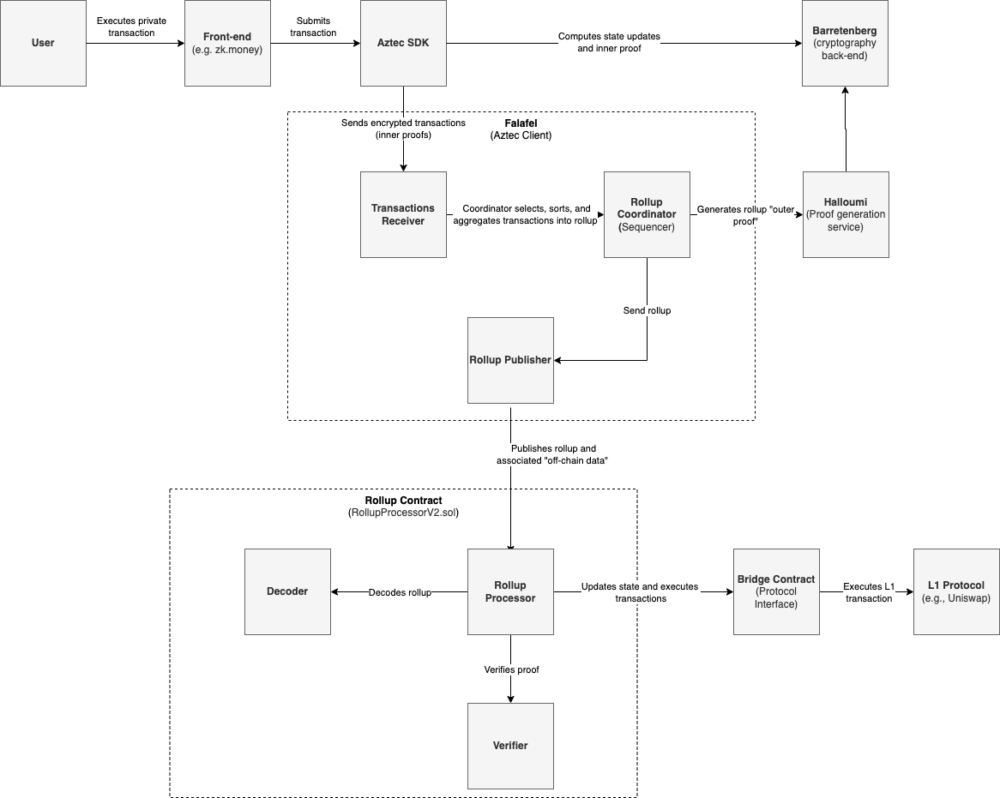
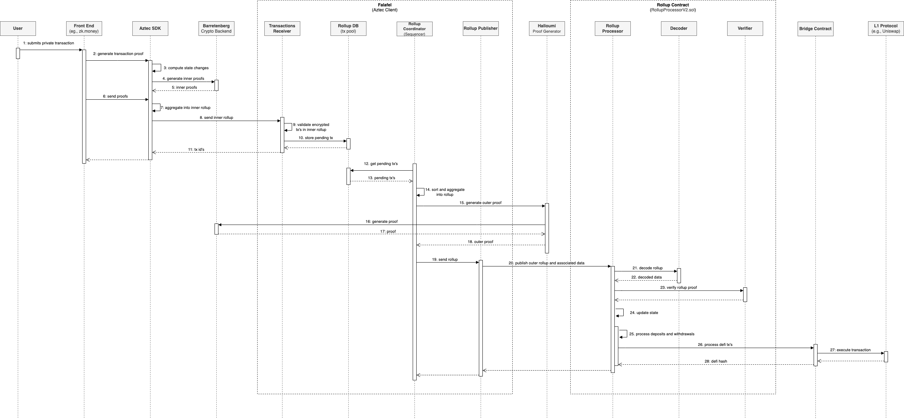
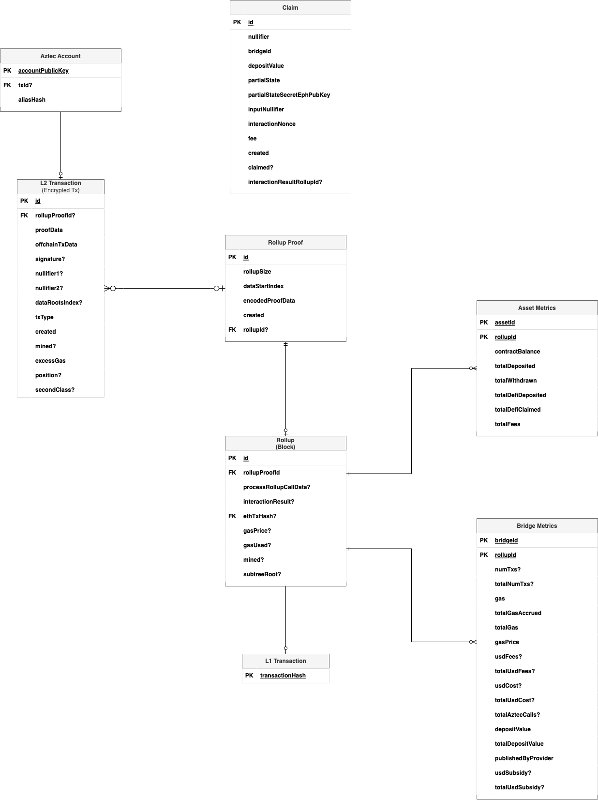

# Aztec Connect
## Glossary
- **Asset Notes:** Also known as value notes, they represent assets in Aztec and are sent around the network via transactions.
- **Aztec Account:** Aztec Connect uses its own type of accounts instead of Ethereum addresses. These accounts are optimized to work better within a circuit and include several extra features, such as aliases, viewing and spending keys, and more.
- **Aztec Connect SDK:** The Aztec SDK allows developers to access the Aztec network. It is designed to abstract away the complexities of zero-knowledge proofs from the developer and end users. It provides a simple API for creating accounts, depositing and withdrawing tokens, and interacting with Ethereum smart contracts anonymously.
- **Aztec Connect Bridge Contract:** A contract that allows Aztec Rollup to interface with other existing Ethereum Layer 1 contracts. For example, the `UniswapBridge.sol` contract can enable Aztec to interact with Uniswap.
- **Barretenberg:** It is Aztec Connect’s cryptography back-end.
- **Decoder:** This is one of the components of the Rollup Contract, responsible for decoding and extracting the encoded proof data of a rollup.
- **Falafel:** This is Aztec Connect's TypeScript implementation of a client, akin to Geth or other Ethereum clients. It performs various tasks, including:
    - Listening for rollup blocks from an Ethereum chain, processing them to maintain the various system Merkle trees, indexing the transactions, and more.
    - Listening for and storing transactions from users, verifying that they are valid, have correct fees, and so on.
    - Orchestrating the construction of new rollups at the appropriate time or when enough transactions are received.
    - Publishing rollups to an Ethereum chain.
- **Halloumi:** This is Aztec Connect's standalone proof generation service.
- **Rollup Contract:** The Rollup contract (`RollupProcessorV2.sol`) is an Ethereum smart contract that holds user deposits, facilitates interactions with other Ethereum contracts from Aztec, and processes Aztec rollup blocks.
- **Rollup:** A rollup is a batch of one or more transactions that are executed off-chain. Aztec Connect supports two types of rollups: inner and outer rollups.
    - Inner rollups (also referred to as inner proof) contain one or more user transactions. They are generated on the end-user hardware to ensure that no secrets are leaked.
    - Outer rollups (also referred to as outer proof) are batches containing many user transactions. They are generated on Falafel.
- **Rollup Proof:** A zero-knowledge proof that proves the correctness of every transaction in a rollup.
- **Transaction Receiver:** This is one of the modules in Falafel, Aztec Connect's client. Its responsibility is to listen for and store transactions from users, verifying that they are valid, have correct fees, and so on.
- **Rollup Processor:** This module is part of Falafel, Aztec Connect's client. Its responsibility is to retrieve pending transactions and construct new rollups when the appropriate time arrives or when enough transactions are received.
- **Rollup Publisher:** This is one of the modules in Falafel, Aztec Connect's client. The module is responsible for dispatching rollups to the Rollup contract in Ethereum.
- **Verifier:** This is one of the components of the Rollup contract. Its responsibility is to verify that the rollup proof is valid for all the transactions in the rollup.

## Transaction Lifecycle
1. The user creates a private transaction through a front-end interface such as https://zk.money/ or an Ethereum app that utilizes the Aztec Connect SDK. 
2. The front end application calls the Aztec Connect SDK to execute the transaction. 
3. The Aztec Connect SDK calculates the state updates of a transaction and invokes the Aztec Connect cryptography backend (Barretenberg) to generate one or more proofs of correctness. Each proof is aggregated into an "encrypted transaction", which includes the proof of correctness, the signature, and any required off-chain transaction data. These encrypted transactions are then consolidated into an "inner rollup.”

    **Note:** This all happens in the user’s hardware to avoid secrets being leaked. 
    
4. The Aztec Connect SDK sends the inner rollup to the Aztec Client (Falafel). 
5. The Transactions Receiver in the Aztec Client receives the inner rollup. It validates each of the encrypted transactions and ensures that they contain the necessary fees. The transactions deemed valid are placed in the pending transactions pool.
6. The Rollup Coordinator, or sequencer, regularly retrieves pending transactions. It selects, sorts, and aggregates the encrypted transactions into a new “outer rollup”.
    
    **Notes:** 
    - The Rollup coordinator determines when to publish a rollup based on the economic profitability.
    - At the moment, there is a limit of 896 encrypted transactions per rollup.
7. The Aztec Client generates the outer proofs for the rollup block.  
    
    **Note:** Proof generation is computationally expensive. Therefore, depending on the Aztec Client configuration, the external proofs can be generated locally or can be delegated to Halloumi, a standalone proof generation service. 
    
8. The rollup publisher module publishes the rollup and the associated ‘off-chain’ data to Ethereum. 
9. The Rollup Contract receives the rollup in an encoded format. The contract decodes the rollup and verifies that the corresponding proof is correct.
10. If the proof is correct, the contract updates its state and executes the encrypted user transactions in the rollup. 
    
    **Note:** The contract will deposit or withdraw funds, or execute DeFi operations depending on the specific transaction. If it is a DeFi transaction, the contract will call an Aztec Connect bridge contract to execute the expected operation on the original Layer 1 contract.

## Architecture

## Sequence Diagram

## Entity-Relationship Diagram
