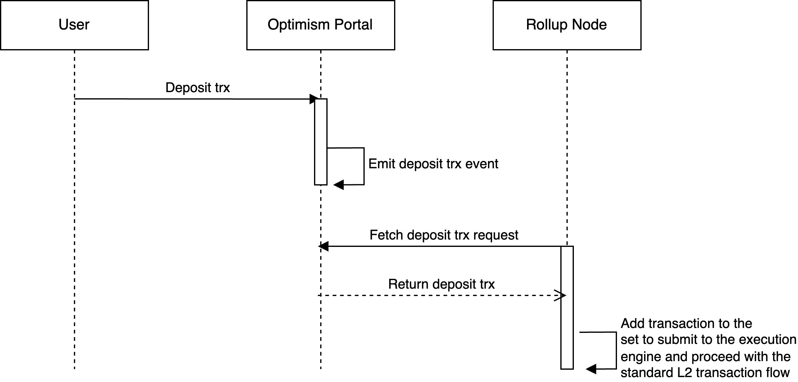
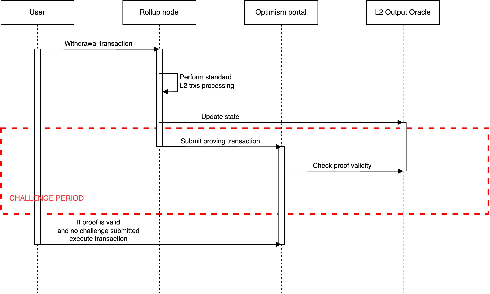
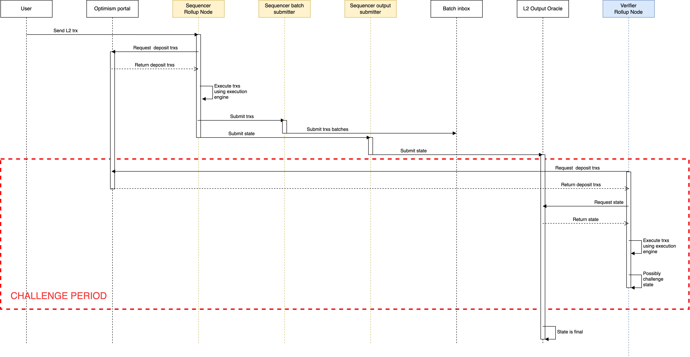
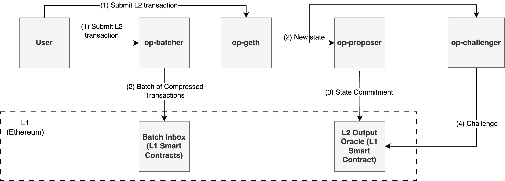
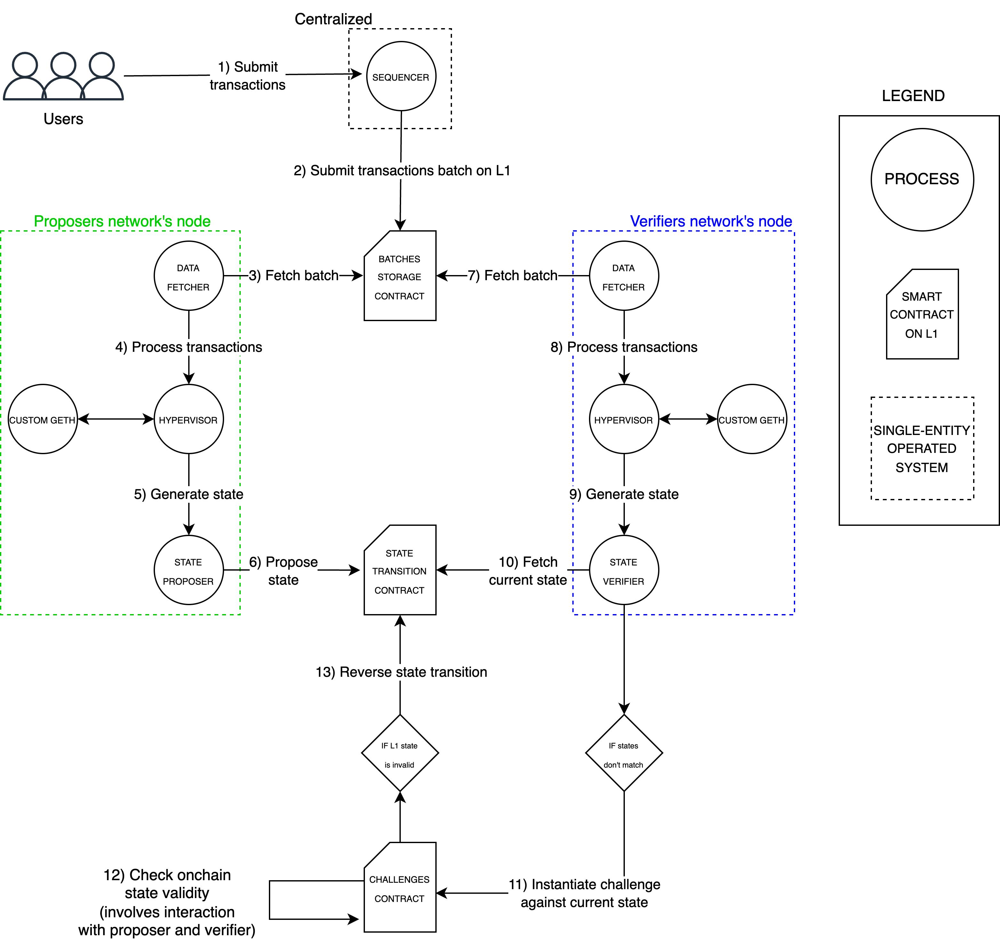
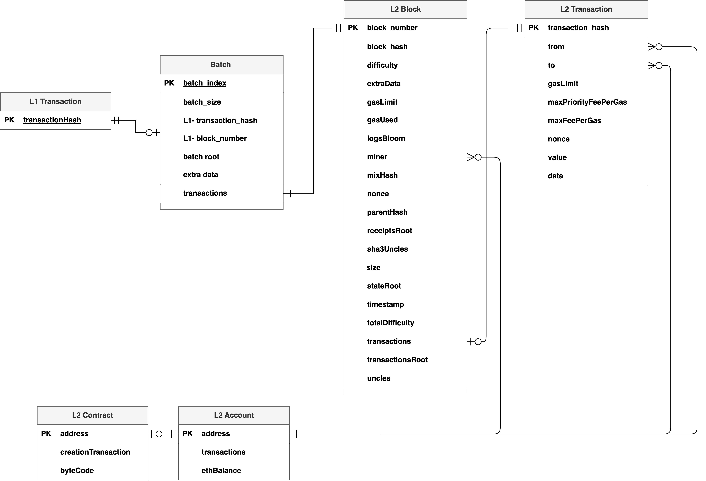

# Optimism-Bedrock 

## Glossary
See also the Optimism glossary(https://github.com/ethereum-optimism/optimism/blob/develop/specs/glossary.md).

- **Block**: A block is a sequential list of transactions, along with a couple of properties stored in the header of the block. For Optimism, as of May 25th 2023, each block includes exactly one transaction.

- **Fraud proof system**: A system implemented to flag state updates as invalid onchain.

- **Challenge game smart contract**: Smart contract responsible for the selection of an instruction that generates a state on which the two or more players of the game disagree on. The state is then provided to the “State transition smart contract”.

- **Dispute game smart contract**: see “Challenge game smart contract”. 

- **State transition smart contract**: Smart contract that takes as input an instruction and a state. It outputs the state modified by the instruction.

- **Batch submitter**: An off-chain component that accepts transactions from users and updates the list of batches on the L1 chain by submitting transactions having a calldata field that contains the batches data.

- **Proposer**: an off-chain component that updates the state of the L2 chain blocks on the L2OutputOracle contract (which is deployed on the L1).

- **Sequencer**: an off-chain component which orchestrates the batch submitter and the proposer. It is either a rollup node ran in sequencer mode, or the operator of this rollup node. The sequencer is a priviledged actor, which receives L2 transactions from L2 users, creates L2 blocks using them, which it then submits to data availability provider (via a batcher). It also submits output roots to L1.

- **Verifier**: An off-chain component that retrieves the batches and blocks statuses form the L1 to check the status validity.

## Transaction Lifecycle
Optimism supports 3 types of transactions: Deposit, Withdraw, and L2 Transaction. The following subsections show the lifecycle of each type of transaction.

### Deposit

Definition: A deposit transaction is a request submitted to the L1 to perform a transaction on the L2.

#### Lifecycle
1. The user sends a L1 transaction depositing funds to the L1 Deposit Contract (deployed by Optimism). 
2. L1 Deposit Contract emits an event containing the amount of funds deposited, the address of the user, and possibly the destination address of the funds on L2.
3. A rollup node captures the event, and create a L2 transaction and proceed with standard L2 transaction flow. 

### Withdraw

Definition: A Withdrawal transaction is a transaction that changes the state of the L2 chain and requests the execution of a transaction on the L1 chain.

#### Lifecycle

1. The user sends a L2 transaction to withdraw their funds to the Output Oracle Contract (deployed by Optimism on L1). 
2. Proceed with the standard L2 transaction flow.
3. After the challenge period, the states submitted to the Output Oracle Contract are finalized.
4. Users are free to withdraw their funds on L1. 

### L2 Transaction

Definition: An L2 transaction is a transaction that changes the state of the L2 chain.

#### Lifecycle
1. Users submit transactions on L2.

2. The sequencer (future: network) submits the transaction data to L1. This only includes the block inputs and no full blocks with state outputs.

3. The OP node listens on the L1 inbox contract for new transactions and forwards them to the execution engine, creating the actual L2 blocks. The OP node keeps track of the finalized (finalized on L1, irreversible on L2), safe (submitted on L1 but not yet final) and unsafe (before step 2) heads. Transactions on L2 are final once the submitted transaction data is finalized on L1 (finalized head).

4. The sequencer periodically posts the output roots to L1. For the outputs to be considered final, the challenge period has to pass in addition to finalization on L1. These outputs are used for inclusion proofs when users want to trigger some action on L1 via an L2 transaction.

## Simplified Architecture

## Architecture

## Optimism Entity Relationship Diagram

As of May 25th, 2023, each Optimism batch contains tens or hundreds of transactions, and each Optimism block contains exactly one transaction. 

