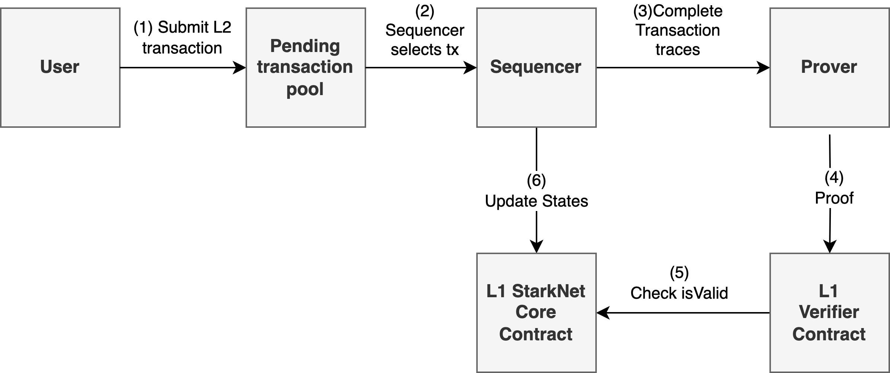
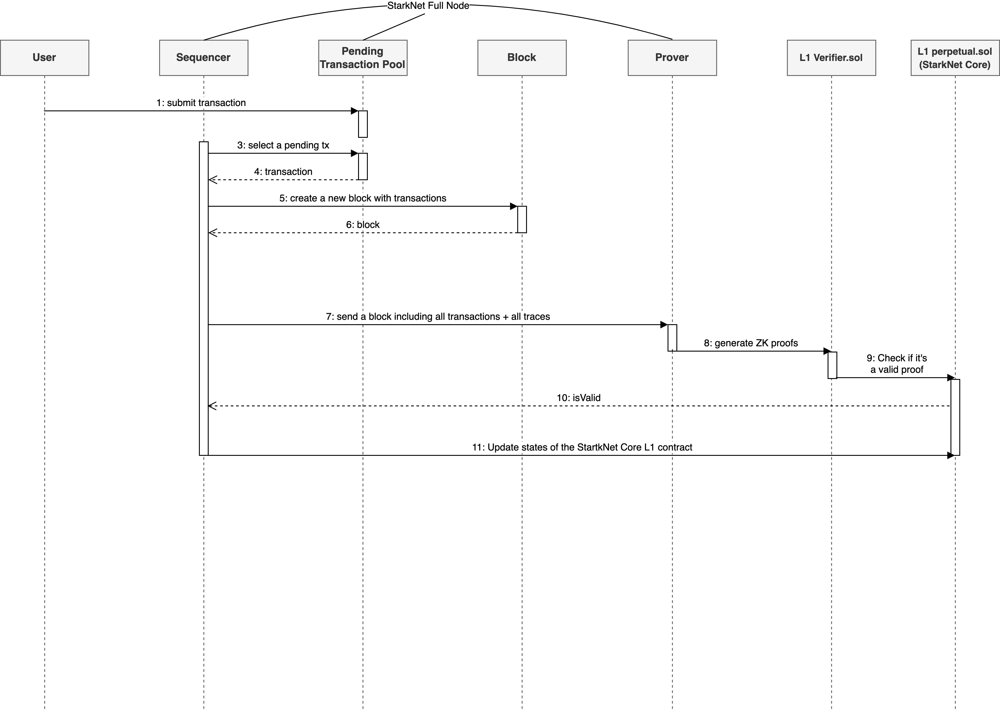
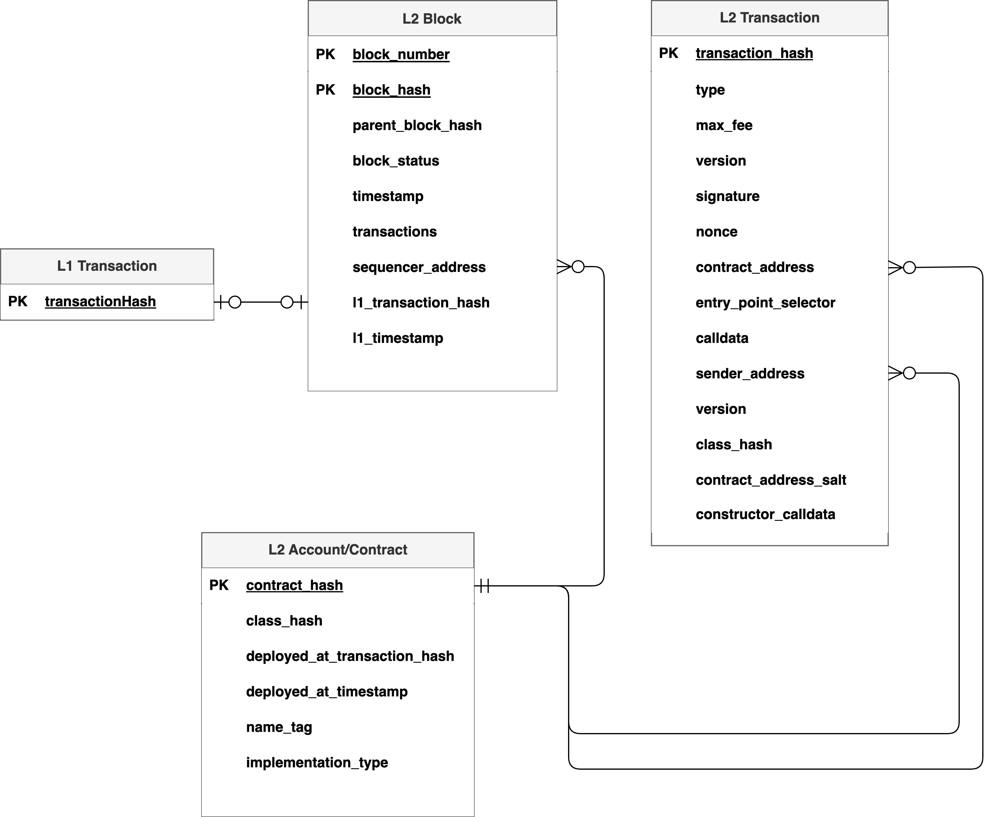
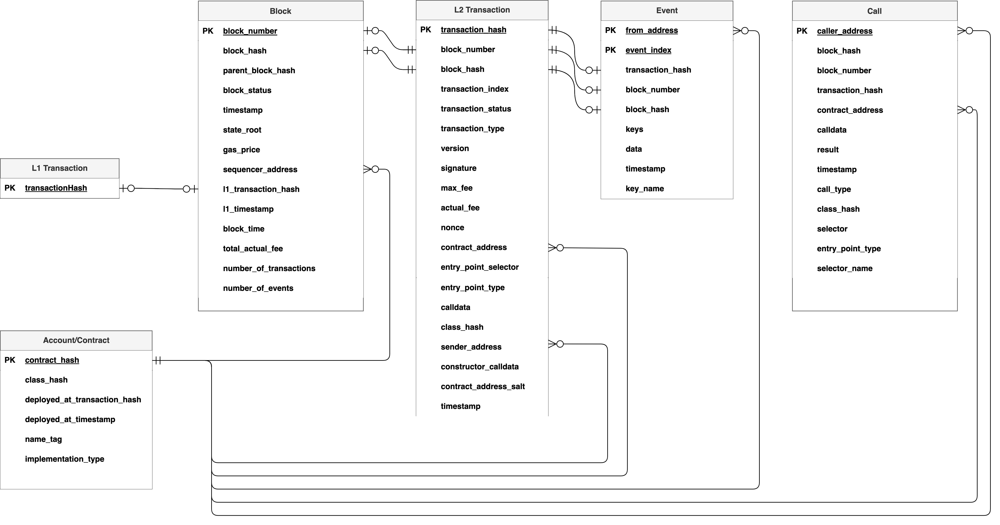
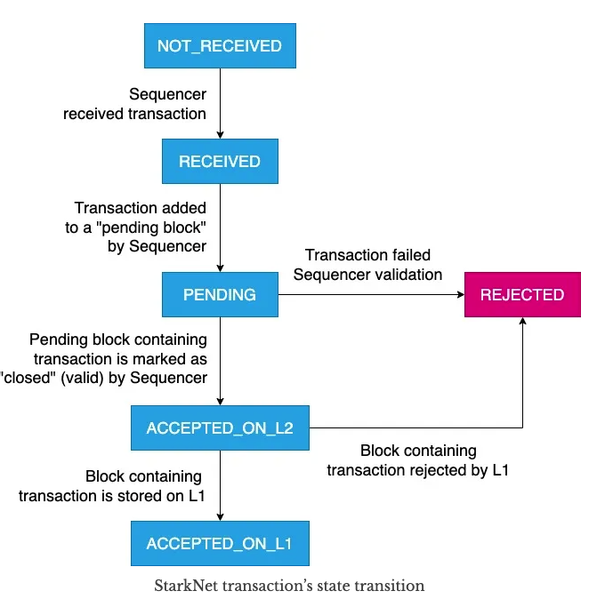

# StarkNet

## Glossary
- **Account/Contract**: In StarkNet, there are no EOAs. All accounts use smart contracts with arbitrary verification logic.
- **Block**: A bundled unit of information that includes all transactions and consensus-related information. In StarkNet, blocks are generated by Sequencer.
- **Sequencer**: Selects transactions from Pending Transaction Pool for execution, generates blocks, and updates the L1 state. In StarkNet, there is no "batch". One block contains many transactions. 
- **Prover**: Takes a block, its transactions, and their traces, and generates a proof of their validity. 
- **Verifier**: A L1 smart contract. It regularly receives proofs from Prover and verifies them.
- **StarkNet Core**: A L1 smart contract. It stores all the states. 
- **L2 Transaction**: A transaction submitted on StarkNet.
- **L1 Transaction**: A transaction submitted on Ethereum.
- **Pending Transaction Pool**: A list of pending transactions on StarkNet waiting for being selected by Sequencer.
- **Operator**: It is an EOA address on Ethereum controlled by the developers. It sends proofs to Verifier, makes Verifier verify the proofs and updates the states of StarkNet Core.
- **Program Output**: A poststate of a contract after executing all transactions of a block.

## Transaction Lifecycle

1. User creates and signs a transaction (tx state: NOT_RECEIVED)
2. User sends the transaction to Sequencer.  
3. Sequencer receives the transaction.  (tx state: RECEIVED)
4. The transaction is placed in the pending transaction pool. (tx state: PENDING)
5. Sequencer selects and executes the transaction from the pending transaction pool.  
    i. The execution fails. Then the transation is rejected by Sequencer. (tx state: REJECTED) 
    ii. The execution succeeds. Then the transaction is accepted by Sequencer. (tx state: ACCEPTED_ON_L2)
6. Sequencer sends Prover the block, including all transactions and their full execution tree. 
7. Prover generates a proof of the block using all execution traces and CAIRO CPU constraints.
8. Prover sends the proof to Verifier. (Operator on L1 makes a call to Verifier with the proof in the calldata). 
9. Verifier verifies the proof and registers a fact associated with the block. (Operator on L1 makes a call to Verifier to verify the proof and if it's valid, Verifier makes a call to StarkNet Core to register a fact.)
10. Sequencer update states of StackNet Core smart contract using Program Output of the block and the fact. (tx state: ACCEPTED_ON_L1)

## Architecture

## Sequence Diagram

## StarkNet Full Node Entity Relationship Diagram

## Block Explorer Entity Relationship Diagram

## Transaction Status

